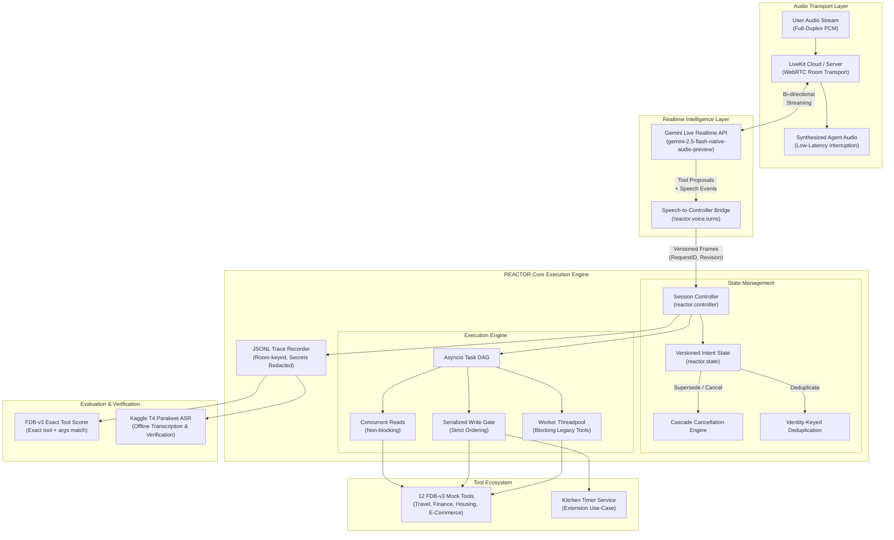

<a id="readme-top"></a>

<!-- PROJECT LOGO -->
<br />
<div align="center">
  <a href="https://github.com/0xkhush/REACTOR">
    
  </a>

  <h1 align="center">REACTOR</h1>

  <p align="center">
    <strong>Correction-Aware Execution Engine for Interruptible Voice Agents</strong>
    <br />
    LiveKit Agents Framework &middot; Gemini Live Realtime API &middot; Versioned Intent Controller &middot; FDB-v3 Benchmark &middot; 12 Mock Tool Domains
    <br />
    <br />
    <a href="#architecture"><strong>Architecture &rarr;</strong></a>
    &middot;
    <a href="#getting-started"><strong>Getting Started &rarr;</strong></a>
    &middot;
    <a href="#benchmark"><strong>Benchmark &rarr;</strong></a>
    &middot;
    <a href="#reproduction"><strong>Reproduction &rarr;</strong></a>
    &middot;
    <a href="#contributing"><strong>Contributing &rarr;</strong></a>
    &middot;
    <a href="docs/livekit-integration-status.md"><strong>Integration Status &rarr;</strong></a>
  </p>
</div>

---

## Overview

**REACTOR** is a voice-native agent execution engine built for the **PRISM GenAI Hackathon — Theme 5: Full-Duplex Voice Agents**. It solves the hard problem of real-time speech correction: when a user says _"Book a flight to Mumbai… actually, Delhi"_, REACTOR's versioned-intent controller cancels the stale Mumbai lookup mid-flight and dispatches the corrected Delhi request without double-booking, without dead air, and without losing context.

The system pairs a **LiveKit Agents** voice frontend with a **Gemini Live** realtime model, routing all tool execution through a correction-aware controller that enforces idempotency, dependency ordering, and cascade cancellation across 12 FDB-v3 mock tools spanning travel, finance, housing, and e-commerce.

### Key Capabilities

| Capability | What It Does | How |
|:---|:---|:---|
| **Stay Responsive** | Spoken feedback within milliseconds, no dead air | Gemini Live realtime streaming — model speaks while tools run in background |
| **Work Asynchronously** | Background tool execution without blocking conversation | `asyncio` task DAG — concurrent reads, serialized writes, blocking tools offloaded to threads |
| **Recover Cleanly** | Discard stale intent, prevent double-execution | Versioned intent frames, identity-keyed deduplication, cascade cancellation |

---

<a id="architecture"></a>

## Architecture



### Controller Guarantees

| Guarantee | Mechanism | Invariant Enforced |
|:---|:---|:---|
| **Stale Intent Cancellation** | Versioned intent frames (`RequestID`, `Revision`) | Superseded tool proposals are cancelled before or during dispatch; stale results discarded |
| **Idempotency & Coalescing** | Action identity hashing (`action_identity`) | Duplicate tool proposals within the same resolved request share execution; no double-booking |
| **State Isolation** | Session-scoped `Controller` | Zero cross-session leakage; state exists only for the lifetime of a single LiveKit room |
| **Write Serialization Gate** | Async write-locking primitive | Read tools run concurrently; state-mutating writes are strictly ordered |
| **Zero Answer Leakage** | Structural isolation of `src/` | Agent source contains zero references to `benchmark_data`, answers, or scenarios |

---

## Project Structure

```
REACTOR/
├── src/reactor/                      # Core Application
│   ├── __init__.py                   # Package marker
│   ├── controller.py                 # Session execution engine (versioned intent, DAG, write gate)
│   ├── state.py                      # Versioned intent frames & slot management
│   ├── trace.py                      # FDB-v3 room-keyed JSONL trace recorder
│   ├── config.py                     # Validated config; secrets excluded from repr()
│   ├── demo.py                       # Scripted offline demo with invariant checks
│   ├── tools/
│   │   ├── base.py                   # Schema-validated tool definitions
│   │   ├── benchmark.py              # 12 FDB-v3 mock tool bridge, pinned revision (3e799c45)
│   │   └── timers.py                 # Kitchen timer service — extension use-case
│   └── voice/
│       ├── agent.py                  # LiveKit + Gemini Live entry point
│       ├── turns.py                  # Speech → controller bridge & duplicate coalescing
│       ├── kitchen.py                # Kitchen voice router & local speech handling
│       ├── speech.py                 # Local audio synthesis & playback
│       ├── events.py                 # Robust voice event logging & task lifecycle
│       └── prompts.py                # Task-general prompts, zero benchmark answers
├── scripts/
│   ├── setup_fdb.py                  # Pin FDB-v3 upstream at exact git SHA (3e799c45)
│   ├── smoke_fdb.py                  # LiveKit smoke runner with credential preflight
│   ├── evaluate_smoke.py             # FDB-v3 exact-match tool scorer (no LLM judge)
│   ├── summarize_smokes.py           # Multi-room summary report generator
│   ├── batch_infer.py                # Resumable Mac batch inference runner (100 recordings)
│   ├── evaluate_batch_calls.py       # Full-denominator call scorer
│   ├── package_batch_results.py      # Artifact packager for Kaggle ASR
│   ├── kitchen_smoke.py              # Same-room kitchen voice workflow smoke
│   ├── build_demo_replay.py          # Demo replay script builder
│   ├── reproduce.sh                  # One-command preflight and reproduction runner
│   └── reproduce.py                  # Benchmark runner entry point
├── remote_eval/                      # Private Kaggle Evaluation Pipeline
│   ├── asr_eval/                     # Parakeet ASR transcription kernel
│   ├── gpu_check/                    # Kaggle T4 GPU environment probe
│   └── overnight/                    # Kaggle batch processing runner
├── tests/                            # 24 test suites, 201 tests (all passing)
│   ├── test_controller.py            # Core execution engine tests
│   ├── test_state.py                 # Versioned intent frame tests
│   ├── test_turns.py                 # Speech → controller bridge & coalescing tests
│   ├── test_voice.py                 # LiveKit tool registration & routing tests
│   ├── test_kitchen_commands.py      # Kitchen command routing & rejection tests
│   ├── test_kitchen_smoke.py         # Kitchen audio lead-in & turn separation tests
│   ├── test_benchmark_tools.py       # FDB-v3 mock tool bridge tests
│   ├── test_timers.py                # Kitchen timer service tests
│   ├── test_config.py                # Credential validation & safety tests
│   ├── test_smoke_fdb.py             # Smoke runner unit tests
│   ├── test_smoke_evaluation.py      # Exact-match evaluator tests
│   ├── test_summarize_smokes.py      # Summary report tests
│   ├── test_evaluate_batch_calls.py  # Full-denominator scoring tests
│   ├── test_reproduction.py          # CLI reproduction runner tests
│   └── ...                           # Additional test modules
├── docs/
│   ├── livekit-integration-status.md # Live smoke evidence & next steps
│   ├── FINAL_CODE_CHECKPOINT.md      # Final code checkpoint & verification status
│   ├── results/
│   │   ├── README.md                 # 100-recording evaluation methodology & findings
│   │   ├── SUMMARY.json              # Hashes, metrics, and dataset boundaries
│   │   └── FDB_v3_exact_reports.zip  # Downloaded Kaggle evaluation reports
│   └── submission/
│       ├── KAGGLE_SETUP.md           # Kaggle GPU transcription reproduction steps
│       ├── SLIDES.md                 # Eight-slide submission presentation deck
│       ├── REACTOR_Submission.pptx   # Editable PowerPoint presentation deck
│       ├── DEMO_SCRIPT.md            # Four-minute live demonstration script
│       └── AI_USAGE_NOTES.md         # Full hackathon AI usage disclosure
├── pyproject.toml                    # Build config, pinned dependencies
├── requirements-dev.lock             # Verified offline environment
├── .env.example                      # Credential template (7 variables)
├── Dockerfile                        # Containerized execution environment
└── logo.png                          # Project logo
```

---

<a id="getting-started"></a>

## Getting Started

### Prerequisites

- **Python**: 3.10–3.12 (verified on 3.12, macOS arm64)
- **No API keys or GPU** needed for offline tests, demo, and controller verification
- **Internet access** required for initial package installation only

### 1. Offline Tests & Demo (No Credentials)

```bash
# Clone repository
git clone https://github.com/0xkhush/REACTOR.git
cd REACTOR

# Set up virtual environment
python3.12 -m venv .venv
.venv/bin/python -m pip install -r requirements-dev.lock -e .

# Run the complete test suite (201 tests)
.venv/bin/python -m pytest -q

# Run the scripted offline demo
.venv/bin/reactor-demo
```

The demo prints JSON showing:
1. A ten-minute timer proposal superseded by a seven-minute correction
2. The old proposal cancelled before execution
3. Two equivalent proposals sharing one timer execution (idempotency)
4. A new cancellation request returning verified cancelled timer state

### 2. FDB-v3 Dataset & Upstream Source

```bash
# Fetch and pin the FDB-v3 upstream (revision 3e799c45) under vendor/
mkdir -p vendor
.venv/bin/python scripts/setup_fdb.py

# Verify dataset and upstream source (no network, no model)
.venv/bin/python scripts/smoke_fdb.py
```

### 3. Live Voice Agent (Requires Credentials)

> **Important:** Confirm your Google AI Studio account's free-tier availability for the specific Gemini Live model before proceeding. An API key alone does not establish that a call costs ₹0.

```bash
# 1. Configure credentials
cp .env.example .env.local
# Fill: LIVEKIT_URL, LIVEKIT_API_KEY, LIVEKIT_API_SECRET,
#       GOOGLE_API_KEY, GOOGLE_LIVE_MODEL, REACTOR_MODE

# 2. Confirm free quota explicitly
# Set REACTOR_FREE_QUOTA_CONFIRMED=yes in .env.local

# 3. Install voice dependencies (LiveKit + Google plugin)
.venv/bin/python -m pip install -e '.[dev,voice]'

# 4. Start the LiveKit agent worker
.venv/bin/python -m reactor.voice.agent dev
```

#### Environment Variables

| Variable | Required | Description |
|:---|:---|:---|
| `LIVEKIT_URL` | ✓ | `wss://` LiveKit Cloud project hostname |
| `LIVEKIT_API_KEY` | ✓ | LiveKit project API key |
| `LIVEKIT_API_SECRET` | ✓ | LiveKit project API secret |
| `GOOGLE_API_KEY` | ✓ | Google AI Studio API key |
| `GOOGLE_LIVE_MODEL` | ✓ | Gemini Live model ID (tested: `gemini-2.5-flash-native-audio-preview-12-2025`) |
| `REACTOR_MODE` | ✓ | `benchmark` (12 FDB tools) or `kitchen` (3 timer tools) |
| `REACTOR_FREE_QUOTA_CONFIRMED` | ✓ | Must be `yes` — agent refuses to connect without this |

### 4. Run a Smoke Recording

```bash
# Stream one released FDB recording to the running agent
.venv/bin/python scripts/smoke_fdb.py --run

# Or start the worker automatically for a bounded smoke recording
.venv/bin/python scripts/smoke_fdb.py --run --start-worker

# Score the result with exact-match (no LLM judge)
.venv/bin/python scripts/evaluate_smoke.py \
  --room ROOM_FROM_SMOKE \
  --input fdb_v3_data_released/EXAMPLE_FOLDER/input.wav
```

---

<a id="benchmark"></a>

## Benchmark Integration & Evidence (FDB-v3)

### 12 Mock Tools Across 4 Domains

| Domain | Tools | Write Operations |
|:---|:---|:---|
| **Travel** | `search_flights`, `book_flight`, `update_identity_doc` | `book_flight`, `update_identity_doc` |
| **Finance** | `get_card_benefits`, `get_exchange_rate`, `modify_autopay` | `modify_autopay` |
| **Housing** | `search_apartments`, `calculate_commute`, `update_search_filter` | `update_search_filter` |
| **E-Commerce** | `track_order`, `search_products`, `add_to_cart` | `add_to_cart` |

All 12 tools are pinned at upstream FDB-v3 revision `3e799c45` and bridged through the versioned controller. Read-only tools execute concurrently; write tools are serialized through the write gate.

### Measured 100-Recording Evaluation Evidence

The resumable Mac capture processed all 100 released FDB-v3 recordings using `gemini-2.5-flash-native-audio-preview-12-2025` via LiveKit Cloud:
- **Transport Reliability:** Zero transport/capture failures across 100 attempts.
- **Executed Calls:** 37 recordings had executed tool calls; 63 had none.
- **Expected Tool Multiset:** Matched in **25/100 (25%)** recordings.
- **Strict Exact-Match Pass:** **12/100 (12%)** exact tool and argument match without semantic relaxation.
- **ASR Pipeline:** Kaggle Tesla T4 running `nvidia/parakeet-tdt-0.6b-v2` with NeMo 2.5.3 (no fine-tuning).
- **Judge:** None. Evaluated strictly with deterministic exact matching (no LLM judge used, ₹0 cost).
- **Archived Data:** Full logs, hashes, and exact reports archived in [`docs/results/`](docs/results/README.md).

### Curated 3-Recording Debug Smoke

| Recording | Observed Tool Call | Exact-Match | Notes |
|:---|:---|:---|:---|
| `ecommerce_01` | `track_order(order_id="ABC123")` | ✓ Pass | Correct tool and argument |
| `travel_01` | `search_flights(destination="Tokyo", date="2026-07-15")` | ✗ Fail | ISO date vs "July 15" — semantically correct |
| `finance_01` | `get_exchange_rate(amount=500, USD→EUR)` |  Flaky | Passes sometimes, intermittent no-call |

```bash
.venv/bin/python scripts/summarize_smokes.py \
  --room reactor-smoke-8fcc845da68c --input fdb_v3_data_released/ecommerce_01_65e8cf8f4c7424fa062e54a3/input.wav \
  --room reactor-smoke-e37a5cecdfdf --input fdb_v3_data_released/travel_01_62a885d5b6af18b3d4579e1b/input.wav \
  --room reactor-smoke-59048ea6a8d9 --input fdb_v3_data_released/finance_01_65e8cf8f4c7424fa062e54a3/input.wav \
  --output artifacts/smoke-summary-exact.json
```

---

<a id="reproduction"></a>

## Reproduction & Deployment

### Automated Reproduction Runner

For Linux NVIDIA CUDA environments with Python 3.10–3.12, git, and ffmpeg:

```bash
# 1. Preflight check (no network calls, validates dependencies & environment)
bash scripts/reproduce.sh --check

# 2. Full pipeline (LiveKit worker + full inference + CUDA Parakeet ASR + exact evaluation)
bash scripts/reproduce.sh

# 3. Optional: with organizer-supplied LLM judge key
bash scripts/reproduce.sh --use-llm
```

### Docker Container

```bash
# Build the container image (includes ffmpeg and espeak-ng)
docker build -t reactor .

# Run with read-only credential mount
docker run --rm --mount type=bind,source="$(pwd)/.env.local",target=/app/.env.local,readonly reactor
```

---

## Extension Use-Case: Kitchen Timer

REACTOR includes a **kitchen timer** mode demonstrating real-world voice correction handling beyond the benchmark:

```bash
# Run real same-room voice smoke test
.venv/bin/python scripts/kitchen_smoke.py
```

- **Three Tools:** `create_timer`, `list_timers`, `cancel_timer`
- **Correction Handling:** _"Set a ten-minute timer… actually, seven minutes"_ → creates a single 420-second timer. The controller cancels the stale 600-second proposal before dispatch and deduplicates the corrected request.
- **Safety:** Unverified native model audio is suppressed in kitchen mode; confirmation uses free local speech synthesis only after verified controller state mutation.

---

## Verification & Testing

```
┌──────────────────────────────────────────────────────────────────────────────────┐
│                            AUTOMATED TEST MATRIX                                 │
├──────────────────────────────┬──────────────────────────────┬────────┬───────────┤
│ Test Suite                   │ Target Layer                 │ Tests  │ Result    │
├──────────────────────────────┼──────────────────────────────┼────────┼───────────┤
│ test_controller.py           │ Core execution engine        │ 40     │ ✓ Passed  │
│ test_state.py                │ Versioned intent frames      │ 16     │ ✓ Passed  │
│ test_turns.py                │ Speech → controller bridge   │ 14     │ ✓ Passed  │
│ test_voice.py                │ LiveKit tool registration    │ 15     │ ✓ Passed  │
│ test_voice_events.py         │ Event logging & error safety │ 1      │ ✓ Passed  │
│ test_benchmark_tools.py      │ FDB-v3 mock tool bridge      │ 4      │ ✓ Passed  │
│ test_timers.py               │ Kitchen timer service        │ 19     │ ✓ Passed  │
│ test_kitchen_commands.py     │ Kitchen command routing      │ 4      │ ✓ Passed  │
│ test_kitchen_smoke.py        │ Audio turn separation        │ 2      │ ✓ Passed  │
│ test_local_speech.py         │ Local speech synthesis       │ 2      │ ✓ Passed  │
│ test_config.py               │ Credential safety            │ 5      │ ✓ Passed  │
│ test_smoke_fdb.py            │ Smoke runner mechanics       │ 9      │ ✓ Passed  │
│ test_smoke_evaluation.py     │ Exact-match evaluator        │ 4      │ ✓ Passed  │
│ test_summarize_smokes.py     │ Summary report generator     │ 2      │ ✓ Passed  │
│ test_evaluate_batch_calls.py │ Full-denominator call scorer │ 2      │ ✓ Passed  │
│ test_batch_infer.py          │ Resumable batch runner       │ 5      │ ✓ Passed  │
│ test_package_batch_results.py│ Kaggle artifact packaging    │ 2      │ ✓ Passed  │
│ test_reproduction.py         │ CLI reproduction flags       │ 2      │ ✓ Passed  │
│ test_archive_evidence.py     │ Evidence archiving & hashes  │ 2      │ ✓ Passed  │
│ test_setup_fdb.py            │ FDB-v3 checkout pinning      │ 2      │ ✓ Passed  │
│ test_tools.py                │ Schema validation            │ 4      │ ✓ Passed  │
│ test_trace.py                │ JSONL trace recording        │ 2      │ ✓ Passed  │
│ test_demo.py                 │ Scripted offline demo        │ 1      │ ✓ Passed  │
│ test_kaggle_bundle.py        │ Kaggle dataset packaging     │ 4      │ ✓ Passed  │
│ test_kaggle_probe.py         │ Kaggle GPU environment probe │ 4      │ ✓ Passed  │
│ test_kaggle_asr.py           │ Kaggle ASR runner            │ 1      │ ✓ Passed  │
│ test_kaggle_overnight.py     │ Kaggle overnight batch job   │ 2      │ ✓ Passed  │
├──────────────────────────────┼──────────────────────────────┼────────┼───────────┤
│ TOTAL                        │ Full source coverage         │ 201    │ ✓ Passed  │
└──────────────────────────────┴──────────────────────────────┴────────┴───────────┘
```

---

## Traces & Logging

`TraceRecorder` writes strict JSONL and flushes each record. Actual-call records follow FDB-v3's room-keyed format:

```json
{
  "room": "reactor-smoke-8fcc845da68c",
  "call": {
    "function": "track_order",
    "args": {"order_id": "ABC123"},
    "timestamp_start": 1727612345.123,
    "timestamp_end": 1727612345.456
  }
}
```

- Every invocation is recorded, including failures and superseded calls
- Proposals cancelled before dispatch appear only in diagnostics
- Credentials are redacted from all trace output
- Failed logging blocks further admission without mutating completed writes

---

## Design Decisions

- **Zero Hardcoded Answers:** The agent source (`src/`) has zero references to `benchmark_data`, expected answers, or scenario IDs. A test explicitly asserts this.
- **Strict Session Isolation:** Each `Controller` is scoped to one LiveKit room. Zero cross-session state or caching across scenarios.
- **Pinned Dependencies:** `livekit-agents==1.3.12`, `livekit-plugins-google==1.3.12`, FDB-v3 pinned to exact git SHA `3e799c45`.
- **Credential Safety:** Config refuses connection without explicit free-quota confirmation. Secrets are excluded from `repr()`, redacted from traces, and never committed.
- **Honest Labeling:** All local results are labeled `official_score: false`. We do not run an unverified semantic LLM judge under ₹0 budget constraints.

---

## Tech Stack

| Layer | Technology | Version |
|:---|:---|:---|
| **Voice Framework** | LiveKit Agents | `1.3.12` |
| **Realtime Model** | Google Gemini Live (via `livekit-plugins-google`) | `1.3.12` |
| **Language** | Python | `3.10–3.12` |
| **Benchmark** | Full-Duplex-Bench v3 | Pinned SHA `3e799c45` |
| **Offline ASR** | NVIDIA Parakeet TDT 0.6B v2 (NeMo) | `2.5.3` |
| **Async Runtime** | `asyncio` | stdlib |
| **Schema Validation** | `jsonschema` | `4.26` |
| **Config** | `python-dotenv` | `1.2` |
| **Testing** | `pytest` + `pytest-asyncio` | `8.4` / `0.26` |

---

## Submission & Design Notes

- [Approved Design](docs/superpowers/specs/2026-09-26-reactor-design.md)
- [Offline-Core Implementation Plan](docs/superpowers/plans/2026-09-26-reactor-core.md)
- [Private Kaggle GPU Evaluation Steps](docs/submission/KAGGLE_SETUP.md)
- [Measured Evaluation Evidence](docs/results/README.md)
- [Eight-Slide Presentation Deck](docs/submission/SLIDES.md) and [Editable PowerPoint (.pptx)](docs/submission/REACTOR_Submission.pptx)
- [Four-Minute Demo Script](docs/submission/DEMO_SCRIPT.md)
- [AI Usage Notes](docs/submission/AI_USAGE_NOTES.md)
- [Final Code Checkpoint](docs/FINAL_CODE_CHECKPOINT.md)

---

<!-- CONTRIBUTING -->
<a id="contributing"></a>

## Contributing

Contributions that make interruptible voice agent execution safer, more reproducible, or easier to understand are welcome.

1. Fork the project.
2. Create a feature branch: `git checkout -b feature/your-feature`.
3. Make the change with focused tests and documentation.
4. Run tests: `.venv/bin/python -m pytest -q`.
5. Commit and push the branch.
6. Open a pull request describing any intent handling, tool execution, or benchmark impact.

<p align="center">
  <a href="https://github.com/0xkhush/REACTOR/graphs/contributors">
    
  </a>
</p>

---

## Acknowledgements

AI assistance was used for planning, implementation, and tests. This is documented in the team's official AI usage disclosure.

---

<p align="center">
  <strong>PRISM GenAI Hackathon 2026 — Theme 5: Full-Duplex Voice Agents</strong>
</p>

<p align="right">(<a href="#readme-top">back to top</a>)</p>
