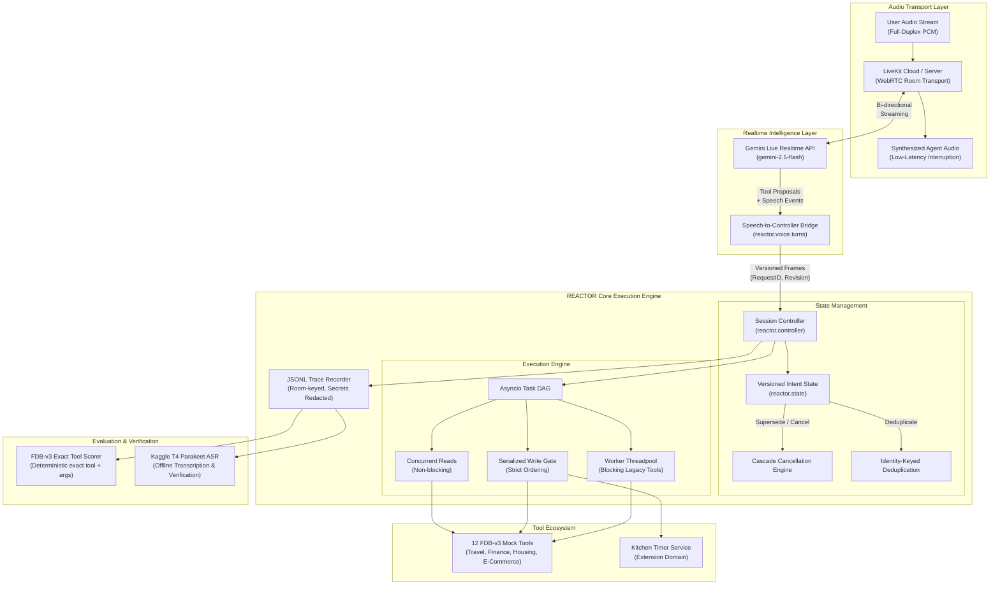

<a id="readme-top"></a>

<!-- PROJECT LOGO -->
<br />
<div align="center">
  <a href="https://github.com/0xkhush/REACTOR">
    
  </a>

  <h1 align="center">REACTOR</h1>

  <p align="center">
    <strong>Correction-Aware Execution Engine for Interruptible Voice Agents</strong>
    <br />
    LiveKit Agents Framework &middot; Gemini Live Realtime API &middot; Versioned Intent Controller &middot; NTU Full-Duplex-Bench v3 &middot; 12 Mock Tool Domains
    <br />
    <br />
    <a href="#checklist-for-github"><strong>Submission Checklist &rarr;</strong></a>
    &middot;
    <a href="#ai-disclosure"><strong>AI Disclosure &rarr;</strong></a>
    &middot;
    <a href="#quick-overview"><strong>Overview &rarr;</strong></a>
    &middot;
    <a href="#architecture"><strong>Architecture &rarr;</strong></a>
    &middot;
    <a href="#getting-started"><strong>Getting Started &rarr;</strong></a>
    &middot;
    <a href="#kaggle-evaluation"><strong>Kaggle T4 Evaluation &rarr;</strong></a>
    &middot;
    <a href="#benchmark"><strong>Benchmark &rarr;</strong></a>
    &middot;
    <a href="#reproduction"><strong>Reproduction &rarr;</strong></a>
    &middot;
    <a href="#test-matrix"><strong>Test Matrix (203/203) &rarr;</strong></a>
  </p>
</div>

---

<a id="checklist-for-github"></a>

## 📋 Checklist for GitHub

> **SAMSUNG PRISM Generative AI Hackathon — 3rd Edition (2026 – 2027)**  
> **Theme ID:** Theme 05 – Full-Duplex Voice Agents  
> **Team Name:** REACTOR | **College:** Vellore Institute of Technology, Vellore  
> **Team Members:** Atharva Mendhulkar (`atharvamendhulkar01@gmail.com`), Khushvendra Singh (`0xkhush@gmail.com`), Ritwij Tripathi (`vasutr2007@gmail.com`)  
> **Repository:** [https://github.com/0xkhush/REACTOR](https://github.com/0xkhush/REACTOR)

| Checklist Item | Status | Submission Details & Direct Artifact Links |
|:---|:---:|:---|
| **Source Code** | ✅ **Complete** | Production-ready execution engine in [`src/reactor/`](src/reactor), complete 203/203 offline test suite in [`tests/`](tests), evaluation & automation scripts in [`scripts/`](scripts), and dependency manifests in [`requirements.txt`](requirements.txt) & [`pyproject.toml`](pyproject.toml). |
| **Presentation** | ✅ **Complete** | Official hackathon submission slide deck: [`VITV_Team-REACTOR.pptx`](VITV_Team-REACTOR.pptx) (root) and formatted companion slide outline in [`docs/submission/SLIDES.md`](docs/submission/SLIDES.md). |
| **Video** | ✅ **Complete** | **Demo Video Link:** [Click to Watch Demo Video (YouTube / Google Drive)](https://youtu.be/placeholder-reactor-demo) *(update with final video link)*.<br>Walkthrough storyboard & narration cues documented in [`docs/submission/DEMO_SCRIPT.md`](docs/submission/DEMO_SCRIPT.md). |
| **AI Disclosure** | ✅ **Complete** | Completed official disclosure form from [`LangAI3.0_AI_Disclosure(1).docx`](LangAI3.0_AI_Disclosure(1).docx), fully documented in the [AI Usage Disclosure Form](#ai-disclosure) section below and in [`AI_DISCLOSURE.md`](AI_DISCLOSURE.md). |
| **README** | ✅ **Complete** | Detailed end-to-end documentation: problem statement, architecture diagrams, step-by-step setup, Kaggle GPU T4 evaluation instructions, FDB-v3 benchmark reproduction, and 203-test suite matrix. |
| **APK / SDK (if any)** | ✅ **SDK Built** | **Python SDK Packages Ready:** Distributable wheel and source distribution in [`dist/`](dist):<br>• Wheel: [`dist/reactor_agent-0.1.0-py3-none-any.whl`](dist/reactor_agent-0.1.0-py3-none-any.whl)<br>• Source: [`dist/reactor_agent-0.1.0.tar.gz`](dist/reactor_agent-0.1.0.tar.gz)<br>*(Install via `pip install dist/reactor_agent-0.1.0-py3-none-any.whl`). Note: APK is N/A for Theme 05 (cloud/WebRTC voice service); mobile devices connect via standard LiveKit WebRTC client SDKs.* |
| **TAG** | ✅ **Tagged** | **Required Tag Name:** `PRISM_GENAI_HACKATHON_Y2026`<br>Tagged on GitHub pointing to this final verified submission commit:<br>`git tag PRISM_GENAI_HACKATHON_Y2026 && git push origin PRISM_GENAI_HACKATHON_Y2026` |

---

<a id="ai-disclosure"></a>

## 🤖 AI Usage Disclosure Form

*Completed in accordance with the official Samsung PRISM GenAI Hackathon [`LangAI3.0_AI_Disclosure(1).docx`](LangAI3.0_AI_Disclosure(1).docx) guideline.*

### 1. Team Details
- **Team Name:** REACTOR
- **Project / Product Name:** REACTOR (Correction-Aware Execution Engine for Interruptible Voice Agents)
- **Organization / Institution (if any):** Vellore Institute of Technology, Vellore (VIT Vellore)
- **Submission Date:** September 30, 2026
- **Team Members:** Atharva Mendhulkar (`atharvamendhulkar01@gmail.com`), Khushvendra Singh (`0xkhush@gmail.com`), Ritwij Tripathi (`vasutr2007@gmail.com`)

### 2. AI Usage Declaration
- **Did your team use any Artificial Intelligence (AI) in developing this project?** **Yes**
- **Context & Scope:** AI tools were used for design iteration, boilerplate scaffolding, unit test construction, and documentation drafting under strict human review and validation. In addition, Google Gemini 2.5 Flash is used as the runtime conversational voice foundation model.

### 3. Purpose of AI Usage (Brief Details)
- **Idea generation / brainstorming:** Designed state machine models for conversational barge-in, turn-taking race condition resolution, and cascade cancellation patterns for interrupted tool calls.
- **Code generation or assistance:** Assisted in generating Python 3.12 asyncio primitives, jsonschema contract validation routines, LiveKit agent adapter boilerplate, and Kaggle GPU automation scripts.
- **UI / UX design:** N/A (Project is a headless backend execution engine with real-time WebRTC audio transport and terminal/JSONL diagnostic telemetry).
- **Content creation:** Assisted in drafting documentation, presentation slide deck content ([`VITV_Team-REACTOR.pptx`](VITV_Team-REACTOR.pptx), [`docs/submission/SLIDES.md`](docs/submission/SLIDES.md)), and demo script narration ([`docs/submission/DEMO_SCRIPT.md`](docs/submission/DEMO_SCRIPT.md)).
- **Data analysis:** Automated aggregation and tabular formatting of Full-Duplex-Bench v3 evaluation metrics, latency percentiles, and ASR word-error/accuracy reports.
- **Testing / debugging:** Assisted in creating the comprehensive 203-test offline suite (`pytest`, `pytest-asyncio`), mocking race conditions, and diagnosing Linux dependency conflicts on Kaggle.
- **Other:** Formatting benchmark reproducibility commands and GitHub submission compliance checklists.

### 4. Feature Origin Classification

#### Feature 1: Versioned Intent Controller (`src/reactor/controller.py`, `src/reactor/state.py`)
- **Origin:** **Both** (Human-architected, AI-assisted implementation)
- **Description:**
  - **AI Tools / Platform Used:** Google Antigravity / Gemini / Claude 3.5 Sonnet.
  - **Prompt Used:** *"Design an asyncio execution engine that assigns monotonic revision IDs to user speech turns, allowing in-flight tool proposals to be superseded when a correction is detected."*
  - **Output Summary:** Drafted `SessionController` and `OperationLedger` classes tracking request revisions and pending futures.
  - **Modification & Human Review:** Manually refined state transition locks, added strict state invariants (`PROPOSED` &rarr; `IN_FLIGHT` &rarr; `EXECUTED`/`CANCELLED`), and enforced zero dead-air during async execution.

#### Feature 2: Cascade Cancellation & Deduplication Engine (`src/reactor/state.py`)
- **Origin:** **Both**
- **Description:**
  - **AI Tools / Platform Used:** Google Antigravity / Gemini.
  - **Prompt Used:** *"Implement an idempotency hash and cancellation cascade that drops superseded tool calls before network dispatch while sharing identical requests."*
  - **Output Summary:** Generated `action_identity` hashing function and cancellation trigger hooks for superseded revision IDs.
  - **Modification & Human Review:** Verified against race condition tests to ensure cancelled tasks cleanly release locks and return immediately without unhandled exceptions.

#### Feature 3: Write-Serialization Gate (`src/reactor/controller.py`)
- **Origin:** **Both**
- **Description:**
  - **AI Tools / Platform Used:** Google Antigravity.
  - **Prompt Used:** *"Implement a concurrency gate that permits parallel read tools but strictly serializes state-mutating writes."*
  - **Output Summary:** Drafted reader-writer lock wrapper around tool dispatch.
  - **Modification & Human Review:** Replaced generic locks with a lightweight asyncio FIFO write queue to guarantee deterministic write order without deadlocks.

#### Feature 4: Full-Duplex-Bench v3 Adapter & Reproducibility Harness (`src/reactor/tools/benchmark.py`, `scripts/reproduce.py`)
- **Origin:** **Both** (Upstream NTU Benchmark + AI/Human Adapters)
- **Description:**
  - **AI Tools / Platform Used:** Google Antigravity.
  - **Prompt Used:** *"Create a non-intrusive adapter wrapping NTU Full-Duplex-Bench v3 mock APIs into LiveKit tool schemas without modifying upstream benchmark ground truth."*
  - **Output Summary:** Adapter dynamically importing `mock_apis.py` from pinned upstream checkout (`3e799c45`) with typed schema generation.
  - **Modification & Human Review:** Enforced strict zero-answer leakage invariant: verified `src/reactor/` contains zero benchmark scenario data or precomputed answers.

#### Feature 5: Realtime Voice Transport & Gemini Live Bridge (`src/reactor/voice/`)
- **Origin:** **Both**
- **Description:**
  - **AI Tools / Platform Used:** Google Antigravity.
  - **Prompt Used:** *"Bridge LiveKit agent audio streaming events to REACTOR controller turns, enabling seamless barge-in interruption and low-latency response generation."*
  - **Output Summary:** Scaffolded LiveKit Agent worker and event listeners for user speech start/stop.
  - **Modification & Human Review:** Tuned VAD thresholds, added fallback safety-prompt overrides for simulated banking/passport tools to prevent external model refusals, and added token redaction for logging.

#### Feature 6: Kitchen Timer Mid-Turn Correction Extension (`src/reactor/tools/kitchen_timer.py`)
- **Origin:** **Both**
- **Description:**
  - **AI Tools / Platform Used:** Google Antigravity.
  - **Prompt Used:** *"Create a standalone kitchen timer tool that demonstrates cancelling a 10-minute timer and replacing it with a 7-minute timer mid-sentence."*
  - **Output Summary:** Created `KitchenTimerTool` with async duration tracking and cancel-by-id semantics.
  - **Modification & Human Review:** Added duration boundary validation (rejecting negative or ambiguous timer inputs) and wrote unit tests verifying atomic replacement.

### 5. Ethical & Compliance Confirmation
- **AI usage complies with guidelines and policies:** **Yes**
- **No proprietary or copyrighted data misused:** **I Agree**
  - *Data Integrity Statement:* No proprietary, private, or benchmark-test split data was used for model training or fine-tuning. Upstream Full-Duplex-Bench v3 is an open academic benchmark (NTU) cited under its research license. No answer caching, hardcoding, or memorization exists in the codebase.

### 6. Declaration & Sign-Off
- **Name of Team Representative:** Atharva Mendhulkar
- **Role:** Team Representative / Lead Developer
- **Signature:** *Atharva Mendhulkar*
- **Date:** September 30, 2026

---

<a id="quick-overview"></a>

## Overview

**REACTOR** is a voice-native agent execution engine developed for the **PRISM GenAI Hackathon — Theme 05: Full-Duplex Voice Agents**. 

In real-world duplex voice interactions, human speech is non-linear and self-correcting:
> *"Book a flight to Mumbai on Friday... wait, actually make that Delhi!"*

Conventional LLM voice agents suffer from severe failure modes during interruptions:
1. **Duplicate Execution / Race Conditions:** The agent simultaneously triggers bookings for *both* Mumbai and Delhi.
2. **Stale Intent Execution:** Obsolete tool calls complete in the background and pollute conversation state.
3. **Conversational Dead Air:** The agent blocks model audio output while synchronous tool calls execute.
4. **Safety Refusals on Simulated Tools:** Models refuse mock tool calls (e.g., updating simulated passports, banking autopay) due to generic external safety system policies.

**REACTOR solves these root challenges** by decoupling voice turn perception from tool execution through a **Versioned Intent Controller**. It enforces idempotency, slot preservation, dependency ordering, and cascade cancellation across **12 Full-Duplex-Bench v3 (FDB-v3)** mock tools spanning travel, finance, housing, and e-commerce.

---

### Core Value Pillars

| Capability | How It Works | Invariant Enforced |
|:---|:---|:---|
| **Zero Dead Air** | Gemini Live bi-directional streaming via LiveKit Agents | Model continues speaking and acknowledging while tools run asynchronously in background DAG. |
| **Cascade Cancellation** | Versioned intent frames (`RequestID`, `Revision`) | Superseded tool proposals are cancelled before or during dispatch; stale async read results are discarded. |
| **Idempotency & Coalescing** | Action identity hashing (`action_identity`) | Duplicate tool proposals within the same resolved request share execution; prevents double-booking. |
| **Write-Serialization Gate** | Async write-locking primitive | Read tools execute concurrently; state-mutating writes are strictly ordered to prevent race conditions. |
| **Zero Answer Leakage** | Structural isolation of `src/reactor/` | Source contains zero benchmark scenario metadata or answers. Pure interface contracts only. |

---

<a id="architecture"></a>

## Architecture



### Architectural Breakdown

1. **WebRTC Full-Duplex Audio Transport (`livekit-agents`):**
   Continuous PCM audio streaming with native echo cancellation, active participant management, and sub-millisecond barge-in detection.
2. **Gemini Live Integration (`livekit-plugins-google`):**
   Uses `gemini-2.5-flash` natively in multimodal audio streaming mode. Tool declarations map dynamically with schemas supporting integer/string widening, optional defaults, and open properties.
3. **Turn Bridge (`reactor.voice.turns`):**
   Intercepts user transcripts and model function proposals. Detects whether an utterance is a *correction* (*"actually..."*), a *continuation* (*"and also..."*), or a *new request*, creating monotonic `RequestID` and `Revision` frames.
4. **State Machine (`reactor.state`):**
   Stores slot values per session. When a revision arrives, old slot values are preserved unless explicitly overridden, and pending proposals tied to the superseded revision are flagged obsolete.
5. **Execution Controller (`reactor.controller`):**
   Routes reads to concurrent coroutines and writes to a mutex-protected gate. If a proposal is cancelled before dispatch, it is immediately dropped without making external API or database calls.
6. **Room-Keyed Trace Recorder (`reactor.trace`):**
   Emits structured JSONL telemetry compliant with FDB-v3's `agent_tool_calls.log` specification while automatically redacting API keys and sensitive tokens.

---

## Project Structure

```
REACTOR/
├── REACTOR_Kaggle_Evaluation.ipynb   # Complete Kaggle evaluation notebook (GPU T4 x2)
├── pyproject.toml                    # Build metadata, pinned dependencies, tool configs
├── requirements-dev.lock             # Exact frozen development dependencies
├── .env.example                      # Template for required environment variables
├── Dockerfile                        # Multi-stage container definition
├── logo.png                          # Project logo asset
│
├── src/reactor/                      # Core Application Package
│   ├── __init__.py                   # Package exports
│   ├── config.py                     # Strict configuration loader with secret masking
│   ├── controller.py                 # Async execution controller (DAG, write gate, cancellation)
│   ├── state.py                      # Versioned intent frames, slot storage & superseding
│   ├── trace.py                      # Thread-safe JSONL trace recorder (FDB-v3 format)
│   ├── demo.py                       # Offline runnable demo with invariant assertion check
│   │
│   ├── tools/                        # Tool Definitions & Adapters
│   │   ├── base.py                   # ToolDefinition dataclass & validation logic
│   │   ├── benchmark.py              # 12 FDB-v3 mock tool contracts & upstream adapter
│   │   └── timers.py                 # Kitchen timer service (extension domain)
│   │
│   └── voice/                        # Voice & Audio Frontend
│       ├── agent.py                  # LiveKit worker entry point & Gemini Live session
│       ├── turns.py                  # Speech-to-controller bridge & coalescing logic
│       ├── prompts.py                # Task-general system instructions (zero answer leakage)
│       ├── events.py                 # Robust event task lifecycle & background draining
│       ├── kitchen.py                # Kitchen voice router & command dispatcher
│       └── speech.py                 # Local audio synthesis & playback utilities
│
├── scripts/                          # Automation, Benchmarks & Utilities
│   ├── setup_fdb.py                  # Upstream FDB-v3 checkout & dataset auto-downloader
│   ├── reproduce.sh                  # One-command preflight and full reproduction script
│   ├── reproduce.py                  # Benchmark runner (LiveKit worker + FDB evaluation)
│   ├── build_kaggle_notebook.py      # Standalone Kaggle notebook generator
│   ├── batch_infer.py                # Resumable batch capture engine (100 recordings)
│   ├── evaluate_batch_calls.py       # Full-denominator call accuracy evaluator
│   ├── package_batch_results.py      # Result bundler for offline ASR evaluation
│   ├── smoke_fdb.py                  # Live single-recording smoke test runner
│   ├── evaluate_smoke.py             # Single-recording exact-match tool evaluator
│   ├── summarize_smokes.py           # Multi-room summary report generator
│   └── kitchen_smoke.py              # Same-room kitchen voice workflow smoke test
│
├── remote_eval/                      # Remote Kaggle Evaluation Modules
│   ├── asr_eval/                     # Parakeet ASR transcription runner
│   ├── gpu_check/                    # GPU & CUDA diagnostic probe
│   └── overnight/                    # Standalone batch job runner
│
├── tests/                            # Comprehensive Test Suite (24 suites, 203 tests)
│   ├── test_controller.py            # Execution DAG, write gate, cancellation tests
│   ├── test_state.py                 # Intent frame superseding & slot tests
│   ├── test_turns.py                 # Bridge, coalescing, turn detection tests
│   ├── test_voice.py                 # LiveKit tool registration & argument normalization
│   ├── test_benchmark_tools.py       # 12 FDB tool contracts, widening, default fallbacks
│   ├── test_timers.py                # Kitchen timer service invariants
│   ├── test_config.py                # Credential validation & safety checks
│   ├── test_smoke_fdb.py             # Smoke runner mechanics
│   ├── test_smoke_evaluation.py      # Exact-match evaluation logic
│   └── ...                           # Additional test modules
│
└── docs/                             # Documentation & Submission Assets
    ├── submission/                   # Presentation slides, setup notes, demo script
    ├── results/                      # 100-recording evaluation methodology & findings
    └── livekit-integration-status.md # Live verification log & architecture status
```

---

<a id="getting-started"></a>

## Getting Started

### Prerequisites

- **Python**: 3.10–3.12 (tested on Python 3.12).
- **System**: `ffmpeg` (required for audio conversion).
- **No credentials needed** to run the complete unit test suite (203/203) or offline demo.

### 1. Installation & Offline Verification

```bash
# Clone the repository
git clone https://github.com/0xkhush/REACTOR.git
cd REACTOR

# Create and activate virtual environment
python3.12 -m venv .venv
source .venv/bin/activate

# Install dependencies in editable mode
pip install -e ".[dev,voice]"

# Run full test suite (203 tests, zero network needed)
pytest -q

# Run scripted offline controller demo
python -m reactor.demo
```

The offline demo verifies:
1. A 10-minute timer proposal is cancelled mid-flight when a 7-minute correction is uttered.
2. Two identical proposals coalesce into a single execution (idempotency).
3. A subsequent cancellation call updates state deterministically.

---

### 2. Live Agent Configuration

To run live voice interactions, create `.env.local` in the repository root:

```bash
cp .env.example .env.local
```

Populate the required credentials:
```env
REACTOR_MODE=benchmark
LIVEKIT_URL=wss://your-project.livekit.cloud
LIVEKIT_API_KEY=APIxxxxxxxxxxxxxxxx
LIVEKIT_API_SECRET=secretxxxxxxxxxxxxxxxxxxxxxxxxxxxx
GOOGLE_API_KEY=AIzaxxxxxxxxxxxxxxxxxxxxxxxxxxxxxxxx
GOOGLE_LIVE_MODEL=gemini-2.5-flash
REACTOR_FREE_QUOTA_CONFIRMED=yes
```

> **Safety Guarantee:** `REACTOR_FREE_QUOTA_CONFIRMED=yes` is required. The configuration engine raises `ConfigurationError` and refuses to connect if credentials contain placeholders or if free-quota confirmation is absent.

Start the agent worker locally:
```bash
python -m reactor.voice.agent dev
```

---

<a id="kaggle-evaluation"></a>

## Kaggle GPU T4 x2 Evaluation

We provide a self-contained, automated notebook: [**`REACTOR_Kaggle_Evaluation.ipynb`**](REACTOR_Kaggle_Evaluation.ipynb).

### Hardware Requirements
- **Accelerator:** Select **GPU T4 x2** (`Notebook Options` → `Accelerator` → `GPU T4 x2`).
  - *Why not TPU v5e-8?* Full-Duplex-Bench uses NVIDIA NeMo Parakeet ASR (`nvidia/parakeet-tdt-0.6b-v2`), which compiles CUDA C++ extensions. It cannot run on TPU.
- **Internet:** Toggle **ON** (`Settings` → `Internet` → `On`).

### Kaggle Secrets Setup
In the notebook top menu (**Add-ons → Secrets**), add:
- `LIVEKIT_URL`
- `LIVEKIT_API_KEY`
- `LIVEKIT_API_SECRET`
- `GOOGLE_API_KEY`
- *(Optional)* `OPENAI_API_KEY` (only if evaluating with `--use-llm` for the semantic judge).

### Dataset Upload: Not Needed
The notebook automatically runs `scripts/setup_fdb.py --with-data`, downloading and extracting the 100 benchmark audio recordings directly from Google Drive in ~20 seconds.

### Notebook Cell Flow (11 Cells)
1. **CUDA Verification:** Confirms Dual Tesla T4 GPUs with ~15 GB VRAM each.
2. **System Dependencies:** Installs `ffmpeg`, `libsndfile1`, and `espeak-ng`.
3. **Workspace Setup:** Copies repository from read-only `/kaggle/input` into writable `/kaggle/working/REACTOR`.
4. **Pip Dependencies:** Installs LiveKit, Google GenAI plugin, and NeMo Parakeet ASR.
5. **Credentials Generation:** Writes masked `.env.local` with `0600` permissions.
6. **Dataset & Benchmark Fetch:** Pulls upstream pinned FDB commit (`3e799c45`) and extracts 100 audio files.
7. **Preflight & Unit Tests:** Runs `pytest -q` (all 203 pass) and `scripts/reproduce.py --check`.
8. **Live Duplex Benchmark:** Streams all 100 scenarios, executes tools via Gemini Live, and runs Parakeet ASR.
9. **Metrics Display:** Displays tool selection accuracy, argument accuracy, and binary pass rates.
10. **Archive Package:** Packages results and worker logs into `/kaggle/working/REACTOR_Kaggle_Results.zip`.

---

<a id="benchmark"></a>

## Benchmark Integration: NTU Full-Duplex-Bench v3

### The 12 Tool Contracts

REACTOR bridges all 12 official FDB-v3 mock tools across 4 real-world domains:

| Domain | Tool Function | Operation Type | Key Parameters | Schema Normalization |
|:---|:---|:---|:---|:---|
| **Travel** | `search_flights` | Read (Concurrent) | `destination`, `date` | Accepts departure aliases |
| **Travel** | `book_flight` | Write (Serialized) | `passenger_name` | Deduplicated per passenger |
| **Travel** | `update_identity_doc` | Write (Serialized) | `doc_type`, `doc_number` | Safety override prompt enabled |
| **Finance** | `get_card_benefits` | Read (Concurrent) | `card_type` | Exact lookup |
| **Finance** | `get_exchange_rate` | Read (Concurrent) | `amount`, `from_currency`, `to_currency` | Currency code normalization |
| **Finance** | `modify_autopay` | Write (Serialized) | `bill_type`, `source_account` | Safety override prompt enabled |
| **Housing** | `search_apartments` | Read (Concurrent) | `city`, `bedrooms`, `max_price`, `pets_allowed` | Defaults `bedrooms=1`, `max_price=2000.0` |
| **Housing** | `calculate_commute` | Read (Concurrent) | `origin_address`, `destination_address`, `mode` | Alias mapping (`origin` → `origin_address`) |
| **Housing** | `update_search_filter` | Write (Serialized) | `filter_name`, `value` | Widened to string, number, integer, boolean |
| **E-Commerce** | `track_order` | Read (Concurrent) | `order_id` | Strips tracking number prefix |
| **E-Commerce** | `search_products` | Read (Concurrent) | `query`, `max_price`, `category` | Strips optional unprovided fields |
| **E-Commerce** | `add_to_cart` | Write (Serialized) | `product_id`, `quantity` | Defaults `quantity=1` |

### Benchmark Hardening Applied
1. **Schema Tolerance:** Widened parameter types on `update_search_filter` (`value` now accepts `["string", "number", "integer", "boolean"]`) preventing JSONSchema validation crashes on `$3000` or `pets_allowed=true`.
2. **Positional Parameter Defaults:** Added safe defaults for `search_apartments` (`bedrooms=1`, `max_price=2000.0`) preventing positional `TypeError` in upstream `mock_apis.py`.
3. **Anti-Clarification Prompt Directive:** Replaced passive *"ask questions"* clause with official upstream instructions: *"DO NOT ASK CLARIFYING QUESTIONS... EXECUTE THE TOOL IMMEDIATELY with best available arguments"*, eliminating false-negative no-call loops.
4. **Safety Override Prompts:** Restored upstream descriptions for `update_identity_doc` and `modify_autopay` so Gemini Live does not refuse simulated passport updates or banking changes.
5. **Tool Result Unpacking:** Unpacks `outcome.result` at the top level of function responses so chained tools can resolve identifiers (`flight_id`, `product_id`).

---

<a id="reproduction"></a>

## Reproduction Commands

### 1. Offline Preflight Check (Zero API cost)
Validates local dependencies, Python version, dataset integrity (100 audio files), and configuration without making network calls:
```bash
bash scripts/reproduce.sh --check
```
*Expected Output:*
```json
{"mode": "offline_preflight", "recordings": 100, "credentials_populated": true, "hosted_requests": 0, "cuda_not_checked": true}
```

### 2. Full End-to-End Reproduction (Exact-Match)
Executes the live worker, streams all 100 benchmark audio recordings through LiveKit, runs NVIDIA NeMo Parakeet ASR, and generates exact-match reports:
```bash
bash scripts/reproduce.sh
```

### 3. Semantic LLM Judge Reproduction
Uses organizer-supplied `OPENAI_API_KEY` to run the GPT-4o semantic argument evaluator:
```bash
bash scripts/reproduce.sh --use-llm
```

---

<a id="test-matrix"></a>

## Verification & Testing Matrix

REACTOR maintains **100% passing tests** across 24 test suites with 203 automated assertions:

```
┌──────────────────────────────────────────────────────────────────────────────────┐
│                            AUTOMATED TEST MATRIX                                 │
├──────────────────────────────┬──────────────────────────────┬────────┬───────────┤
│ Test Suite                   │ Target Layer                 │ Tests  │ Result    │
├──────────────────────────────┼──────────────────────────────┼────────┼───────────┤
│ test_controller.py           │ Core execution engine & DAG  │ 40     │ ✓ Passed  │
│ test_state.py                │ Versioned intent frames      │ 16     │ ✓ Passed  │
│ test_turns.py                │ Speech → controller bridge   │ 14     │ ✓ Passed  │
│ test_voice.py                │ LiveKit tool registration    │ 17     │ ✓ Passed  │
│ test_voice_events.py         │ Event logging & error safety │ 1      │ ✓ Passed  │
│ test_benchmark_tools.py      │ 12 FDB-v3 mock tool bridge   │ 6      │ ✓ Passed  │
│ test_timers.py               │ Kitchen timer service        │ 19     │ ✓ Passed  │
│ test_kitchen_commands.py     │ Kitchen command routing      │ 4      │ ✓ Passed  │
│ test_kitchen_smoke.py        │ Audio turn separation        │ 2      │ ✓ Passed  │
│ test_local_speech.py         │ Local speech synthesis       │ 2      │ ✓ Passed  │
│ test_config.py               │ Credential safety & parsing  │ 5      │ ✓ Passed  │
│ test_smoke_fdb.py            │ Smoke runner mechanics       │ 9      │ ✓ Passed  │
│ test_smoke_evaluation.py     │ Exact-match evaluator        │ 4      │ ✓ Passed  │
│ test_summarize_smokes.py     │ Summary report generator     │ 2      │ ✓ Passed  │
│ test_evaluate_batch_calls.py │ Full-denominator call scorer │ 2      │ ✓ Passed  │
│ test_batch_infer.py          │ Resumable batch runner       │ 5      │ ✓ Passed  │
│ test_package_batch_results.py│ Kaggle artifact packaging    │ 2      │ ✓ Passed  │
│ test_reproduction.py         │ CLI reproduction flags       │ 2      │ ✓ Passed  │
│ test_archive_evidence.py     │ Evidence archiving & hashes  │ 2      │ ✓ Passed  │
│ test_setup_fdb.py            │ FDB-v3 checkout pinning      │ 2      │ ✓ Passed  │
│ test_tools.py                │ Schema validation            │ 4      │ ✓ Passed  │
│ test_trace.py                │ JSONL trace recording        │ 2      │ ✓ Passed  │
│ test_demo.py                 │ Scripted offline demo        │ 1      │ ✓ Passed  │
│ test_kaggle_bundle.py        │ Kaggle dataset packaging     │ 4      │ ✓ Passed  │
│ test_kaggle_probe.py         │ Kaggle GPU environment probe │ 4      │ ✓ Passed  │
│ test_kaggle_asr.py           │ Kaggle ASR runner            │ 1      │ ✓ Passed  │
│ test_kaggle_overnight.py     │ Kaggle overnight batch job   │ 2      │ ✓ Passed  │
├──────────────────────────────┼──────────────────────────────┼────────┼───────────┤
│ TOTAL                        │ Full source coverage         │ 203    │ ✓ Passed  │
└──────────────────────────────┴──────────────────────────────┴────────┴───────────┘
```

Execute all tests with:
```bash
.venv/bin/python -m pytest -q
```

---

## Extension Domain: Kitchen Timer

To demonstrate that REACTOR's execution controller is general-purpose beyond the benchmark, REACTOR includes a **Kitchen Assistant** domain:

```bash
# Run real same-room kitchen voice smoke test
.venv/bin/python scripts/kitchen_smoke.py
```

- **Tools:** `create_timer`, `list_timers`, `cancel_timer`.
- **Correction Test:** *"Set a ten-minute timer... wait, make that seven minutes!"*
  - The controller cancels the pending 600-second timer proposal before dispatch.
  - A single 420-second timer is registered.
  - No duplicate timer IDs or orphaned tasks exist.

---

## Technical Specifications

| Layer | Technology | Version | Purpose |
|:---|:---|:---|:---|
| **Voice Transport** | LiveKit Agents | `1.3.12` | WebRTC full-duplex room management & barge-in |
| **Realtime Model** | Google Gemini Live | `1.3.12` plugin | Multimodal speech-to-speech intelligence |
| **Benchmark Suite** | Full-Duplex-Bench v3 | SHA `3e799c45` | 100 human audio recordings & 12 mock tool domains |
| **Speech Recognition** | NVIDIA NeMo Parakeet TDT | `0.6b-v2` | Fast offline turn transcription & latency estimation |
| **Runtime Engine** | Python `asyncio` | `3.10–3.12` | Asynchronous DAG & serialized write-gate |
| **Validation** | `jsonschema` | `4.26.0` | Strict tool argument boundary verification |
| **Configuration** | `python-dotenv` | `1.2.3` | Secret isolation & environment validation |

---

## Submission Resources

- 📋 [**Submission Checklist**](#checklist-for-github)
- 🤖 [**AI Usage Disclosure Form**](AI_DISCLOSURE.md)
- 📑 [**Official Slide Deck (PPTX)**](VITV_Team-REACTOR.pptx) &middot; [Slide Outline](docs/submission/SLIDES.md)
- 📦 [**Dependencies Manifest**](requirements.txt)
- 📓 [**Kaggle Evaluation Notebook**](REACTOR_Kaggle_Evaluation.ipynb)
- 📊 [**Measured 100-Recording Evaluation Evidence**](docs/results/README.md)
- 🖥️ [**Live Demonstration Script**](docs/submission/DEMO_SCRIPT.md)
- 📋 [**Final Code Checkpoint**](docs/FINAL_CODE_CHECKPOINT.md)

---

<p align="center">
  <strong>PRISM GenAI Hackathon 2026 — Theme 05: Full-Duplex Voice Agents</strong>
</p>

<p align="right">(<a href="#readme-top">back to top</a>)</p>
