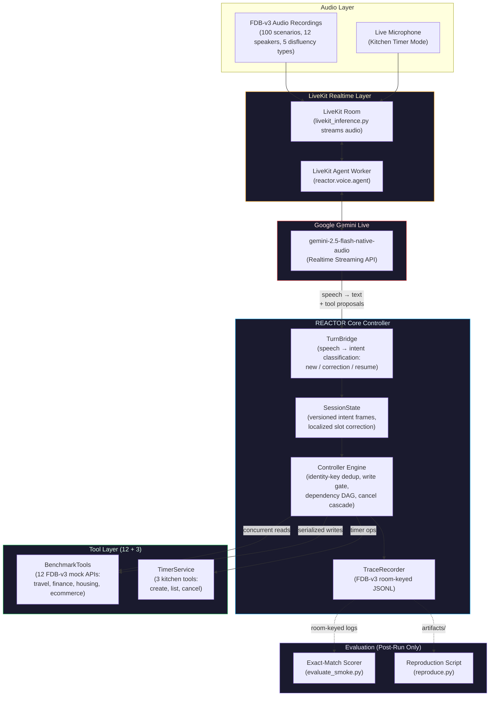

<a id="readme-top"></a>

<!-- PROJECT LOGO -->
<br />
<div align="center">
  <a href="https://github.com/0xkhush/REACTOR">
    
  </a>

  <h1 align="center">REACTOR</h1>

  <p align="center">
    <strong>Correction-Aware Execution Engine for Interruptible Voice Agents</strong>
    <br />
    LiveKit Agents Framework &middot; Gemini Live Realtime API &middot; Versioned Intent Controller &middot; FDB-v3 Benchmark &middot; 12 Mock Tool Domains
    <br />
    <br />
    <a href="#architecture"><strong>Architecture &rarr;</strong></a>
    &middot;
    <a href="#getting-started"><strong>Getting Started &rarr;</strong></a>
    &middot;
    <a href="#benchmark"><strong>Benchmark &rarr;</strong></a>
    &middot;
    <a href="docs/livekit-integration-status.md"><strong>Integration Status &rarr;</strong></a>
  </p>
</div>

---

## Overview

**REACTOR** is a voice-native agent execution engine built for the **PRISM GenAI Hackathon — Theme 5: Full-Duplex Voice Agents**. It adds correction-aware execution: when a user says _"Book a flight to Boston… actually, Chicago"_, the controller can reject superseded pending work after the turn bridge classifies the correction. An already-dispatched write remains recorded; cancellation cannot undo it.

**Latest measured benchmark:** the native-schema candidate `ceafcee` scored **30/100 strict exact tool/argument passes** and **54/100 expected tool selections**. All 100 cases stayed in the denominator: 85 had calls, 13 had none, and 2 timed out. Fourteen pre-audio LiveKit connection failures recovered on retry. The previous `36a798b` run scored 23/100. These are local call-only diagnostics without ASR or a semantic judge; the 40% strict-pass target was not met. The final report is ignored at `artifacts/batch_ceafcee/call-exact-after-transport-retry.json`.

**Integrated verification:** 234 tests passed after two kitchen parser fixes. See [code verification](docs/FINAL_CODE_CHECKPOINT.md), [earlier measured evidence](docs/results/README.md), and the [benchmark workflow](docs/BENCHMARK_HANDOFF.md). Historical checkpoint documents identify the revisions they measured.

The system pairs a **LiveKit Agents** voice frontend with a **Gemini Live** realtime model, routing all tool execution through a correction-aware controller that enforces idempotency, dependency ordering, and cascade cancellation across 12 FDB-v3 mock tools spanning travel, finance, housing, and e-commerce.

### Key Capabilities

| Capability | What It Does | How |
|:---|:---|:---|
| **Stay Responsive** | Realtime audio streaming; sub-second latency remains unverified | Gemini Live realtime streaming with async tool execution |
| **Work Asynchronously** | Background tool execution without blocking conversation | `asyncio` task DAG — concurrent reads, serialized writes, blocking tools offloaded to threads |
| **Recover Cleanly** | Discard stale intent, prevent double-execution | Versioned intent frames, identity-keyed deduplication, cascade cancellation |

---

<a id="architecture"></a>

## Architecture



### Controller Guarantees

| Guarantee | Mechanism |
|:---|:---|
| **Stale intent rejection** | Corrections bump `intent_version`; `_cancel_pending()` cascades cancellation to all ops under the old version |
| **Idempotent execution** | Identity key `(request_id, intent_revision, action_id)` deduplicates — same key shares one execution and result |
| **Dependency ordering** | Chained tools wait for parent success; parent failure cascades to dependents |
| **Write serialization** | `_write_lane = asyncio.Lock()` gates state-modifying tools; read-only tools run in parallel |
| **No answer leakage** | Agent source (`src/`) has zero references to benchmark answers; test explicitly asserts `"benchmark_data" not in repr(tools)` |
| **No cross-session state** | Each `Controller` instance is scoped to one LiveKit room; no persistence layer |

### Execution limits

- Corrections preserve unaffected slots and reject obsolete proposals at dispatch.
- `begin_input()` holds new dispatches; `resolve_input()` explicitly classifies the input as a new request, correction, or resume. This core does not interpret speech or detect semantic corrections.
- The same `(request_id, intent_revision, action_id)` shares an execution and result. Reusing it with different arguments raises a conflict. The turn bridge binds provider IDs and known speech generations to their original request, coalesces same-request retries, and accepts explicit logical IDs for intentional identical actions. Repeat recognition remains limited; arbitrary semantic repeats need clarification or explicit IDs.
- Dependent operations wait for successful, relevant parent outcomes. Schema validation does not prove semantic argument correctness.
- Read delivery waits while new input is unresolved; snapshots hide those read payloads. A confirmed correction promptly cancels pending work even when its predecessor is still running. Late obsolete read results are hidden from current consumers. Successful superseded writes remain visible as historical outcomes.
- Cancelling a caller does not cancel an already-dispatched write. The controller observes its owned task and records the result. A thrown write exception becomes `outcome_unknown`, not an automatic retry.
- No crash-safe exactly-once guarantee or general rollback. State is in memory, and a worker thread cannot be forcibly cancelled. `close()` drains owned executions; an indefinitely blocked backend can therefore block shutdown. The future adapter must define overall scenario deadlines and backend timeouts.
- Call `controller.close()` before closing the session's tool resources, and use `finally` to close those resources even if the controller reports a logging failure. Timers use monotonic deadlines; completed timers cannot be retroactively cancelled.

---

## Project Structure

```
REACTOR/
├── src/reactor/                      # Core Application
│   ├── __init__.py                   # Package marker
│   ├── controller.py                 # Session execution engine (247 lines)
│   │                                 #   versioned intent, cancellation, DAG, write gate
│   ├── state.py                      # Versioned intent frames & slot management (123 lines)
│   ├── trace.py                      # FDB-v3 room-keyed JSONL trace recorder (46 lines)
│   ├── config.py                     # Validated config; secrets excluded from repr() (65 lines)
│   ├── demo.py                       # Scripted offline demo with invariant checks (59 lines)
│   ├── tools/
│   │   ├── base.py                   # Schema-validated tool definitions (44 lines)
│   │   ├── benchmark.py              # 12 FDB-v3 mock tool bridge, pinned revision (74 lines)
│   │   └── timers.py                 # Kitchen timer service — extension use-case (104 lines)
│   └── voice/
│       ├── agent.py                  # LiveKit + Gemini Live entry point (204 lines)
│       ├── turns.py                  # Speech → controller bridge (74 lines)
│       └── prompts.py                # Task-general prompts, no benchmark answers (23 lines)
├── scripts/
│   ├── setup_fdb.py                  # Pin FDB-v3 upstream at exact git SHA
│   ├── smoke_fdb.py                  # LiveKit smoke runner with credential preflight
│   ├── evaluate_smoke.py             # FDB-v3 exact-match tool scorer (no LLM judge)
│   ├── summarize_smokes.py           # Multi-room summary report generator
│   └── reproduce.py                  # Full benchmark reproduction (requires CUDA Linux)
├── tests/                            # Core, voice and evaluation tests; 234 passing
│   ├── test_controller.py            # 643 lines — core execution engine tests
│   ├── test_state.py                 # Versioned intent frame tests
│   ├── test_turns.py                 # Speech → controller bridge tests
│   ├── test_voice.py                 # LiveKit tool registration & integration tests
│   ├── test_benchmark_tools.py       # FDB-v3 mock tool bridge tests
│   ├── test_timers.py                # Kitchen timer service tests
│   ├── test_config.py                # Credential validation & safety tests
│   ├── test_smoke_fdb.py             # Smoke runner unit tests
│   ├── test_smoke_evaluation.py      # Exact-match evaluator tests
│   ├── test_summarize_smokes.py      # Summary report tests
│   └── ...                           # Additional test modules
├── docs/
│   └── livekit-integration-status.md # Live smoke evidence & next steps
├── pyproject.toml                    # Build config, pinned dependencies
├── requirements-dev.lock             # Verified offline environment (14 packages)
├── .env.example                      # Credential template (7 variables)
└── logo.png                          # Project logo
```

---

<a id="getting-started"></a>

## Getting Started

### Prerequisites

- **Python**: 3.10–3.12 (verified on 3.12, macOS arm64)
- **No API keys or GPU** needed for offline tests and demo
- **Internet access** required for package installation only

### 1. Offline Tests & Demo (No Credentials)

```bash
# Clone and set up
git clone https://github.com/0xkhush/REACTOR.git
cd REACTOR
python3.12 -m venv .venv
.venv/bin/python -m pip install -r requirements-dev.lock -e '.[voice]'
mkdir -p vendor
.venv/bin/python scripts/setup_fdb.py

# Run the full test suite; integration tests require the pinned upstream checkout
.venv/bin/python -m pytest -q

# Run the scripted offline demo
.venv/bin/reactor-demo
```

The demo prints JSON showing:
1. A ten-minute timer proposal superseded by a seven-minute correction
2. The old proposal cancelled before execution
3. Two equivalent proposals sharing one timer execution (idempotency)
4. A new cancellation request returning verified cancelled timer state

### 2. FDB-v3 Dataset & Upstream Source

```bash
# Fetch the pinned FDB-v3 upstream (Git-ignored vendor/ directory)
mkdir -p vendor
.venv/bin/python scripts/setup_fdb.py

# Verify dataset and upstream source (no network, no model)
.venv/bin/python scripts/smoke_fdb.py
```

### 3. Live Voice Agent (Requires Credentials)

> **Important:** Confirm your Google AI Studio account's free-tier availability for the specific Gemini Live model before proceeding. An API key alone does not establish that a call costs ₹0.

1. Tested model: `gemini-2.5-flash-native-audio-preview-12-2025`. The user confirmed Free-tier access and ₹0 usage during testing. Other evaluators must check their own quota; the code never selects a paid fallback.
2. Copy `.env.example` to your ignored `.env.local`. Fill the LiveKit URL, key, secret, Google API key and `GOOGLE_LIVE_MODEL` with the confirmed model ID. Set `REACTOR_MODE=benchmark` or `kitchen`.
3. Only after confirming free access and no paid overage, set `REACTOR_FREE_QUOTA_CONFIRMED=yes` locally. The entry point refuses to connect without this flag. No code here chooses a paid fallback provider.
4. Install the pinned agent and matching Google plugin, then start the worker:

```bash
# 1. Configure credentials
cp .env.example .env.local
# Fill: LIVEKIT_URL, LIVEKIT_API_KEY, LIVEKIT_API_SECRET,
#       GOOGLE_API_KEY, GOOGLE_LIVE_MODEL, REACTOR_MODE

# 2. Confirm free quota explicitly
# Set REACTOR_FREE_QUOTA_CONFIRMED=yes in .env.local

# 3. Install voice dependencies (LiveKit + Google plugin)
.venv/bin/python -m pip install -e '.[dev,voice]'

# 4. Start the LiveKit agent worker
.venv/bin/python -m reactor.voice.agent dev
```

#### Environment Variables

| Variable | Required | Description |
|:---|:---|:---|
| `LIVEKIT_URL` | ✓ | `wss://` LiveKit Cloud project hostname |
| `LIVEKIT_API_KEY` | ✓ | LiveKit project API key |
| `LIVEKIT_API_SECRET` | ✓ | LiveKit project API secret |
| `GOOGLE_API_KEY` | ✓ | Google AI Studio API key |
| `GOOGLE_LIVE_MODEL` | ✓ | Gemini Live model ID (e.g., `gemini-2.5-flash-native-audio-preview-12-2025`) |
| `REACTOR_MODE` | ✓ | `benchmark` (12 FDB tools) or `kitchen` (3 timer tools) |
| `REACTOR_FREE_QUOTA_CONFIRMED` | ✓ | Must be `yes` — agent refuses to connect without this |

### 4. Run a Smoke Recording

```bash
# Stream one FDB recording to the running agent
.venv/bin/python scripts/smoke_fdb.py --run

# Or start the worker automatically for one recording
.venv/bin/python scripts/smoke_fdb.py --run --start-worker

# Score the result with exact-match (no LLM judge)
.venv/bin/python scripts/evaluate_smoke.py \
  --room ROOM_FROM_SMOKE \
  --input fdb_v3_data_released/EXAMPLE_FOLDER/input.wav
```

---

<a id="benchmark"></a>

## Benchmark Integration (FDB-v3)

### 12 Mock Tools Across 4 Domains

| Domain | Tools | Write Operations |
|:---|:---|:---|
| **Travel** | `search_flights`, `book_flight`, `update_identity_doc` | `book_flight`, `update_identity_doc` |
| **Finance** | `get_card_benefits`, `get_exchange_rate`, `modify_autopay` | `modify_autopay` |
| **Housing** | `search_apartments`, `calculate_commute`, `update_search_filter` | `update_search_filter` |
| **E-Commerce** | `track_order`, `search_products`, `add_to_cart` | `add_to_cart` |

All 12 tools are pinned at upstream FDB-v3 revision `3e799c45` and bridged through the versioned controller. Read-only tools execute concurrently; write tools are serialized through the write gate.

### Smoke Evidence

| Recording | Observed Tool Call | Exact-Match | Notes |
|:---|:---|:---|:---|
| `ecommerce_01` | `track_order(order_id="ABC123")` | ✓ Pass | Correct tool and argument |
| `travel_01` | `search_flights(destination="Tokyo", date="2026-07-15")` | ✗ Fail | ISO date vs "July 15" — semantic equivalence was not judged |
| `finance_01` | `get_exchange_rate(amount=500, USD→EUR)` |  Flaky | Passes sometimes, intermittent no-call |

> **Note:** These are curated debug samples, not representative benchmark scores. Reports are labeled `official_score: false` and `judge: none`.

### Full Benchmark Reproduction (CUDA Linux)

```bash
# Requires: Linux, NVIDIA CUDA, ffmpeg, confirmed-free Gemini Live model
.venv/bin/python scripts/reproduce.py
```

### Historical full captures

The earlier mixed-revision Mac capture processed all 100 recordings: 37 had executed tool calls, 63 had none, and zero failed at the capture/transport stage. The pinned exact tool evaluator reported 25/100 expected tool selections and 12/100 strict passes. A newer single-revision capture at `36a798b` recorded **59 calls, 41 no-tool recordings, zero transport failures**, with **42/100 expected tool selections and 23/100 strict exact passes**. Neither report used an LLM judge, and only the earlier audio has Kaggle ASR transcripts. These are local diagnostics, not official normalized scores.

The current **three-recording smoke sample** selected the expected tool in all three cases. FDB-v3's local exact-match check passed ecommerce and finance, and rejected travel's ISO date formatting. This is a curated debug sample, not a representative benchmark estimate. A rerunnable summary is available with:

```bash
.venv/bin/python scripts/summarize_smokes.py \
  --room reactor-smoke-8fcc845da68c --input fdb_v3_data_released/ecommerce_01_65e8cf8f4c7424fa062e54a3/input.wav \
  --room reactor-smoke-e37a5cecdfdf --input fdb_v3_data_released/travel_01_62a885d5b6af18b3d4579e1b/input.wav \
  --room reactor-smoke-59048ea6a8d9 --input fdb_v3_data_released/finance_01_65e8cf8f4c7424fa062e54a3/input.wav \
  --output artifacts/smoke-summary-exact.json
```

The report labels `official_score: false`, `judge: none`, and separates tool-selection from exact argument checks.

In kitchen mode, `.venv/bin/python scripts/kitchen_smoke.py` records a real same-room voice workflow. The latest smoke created a named pasta timer at 420 seconds after a spoken ten-to-seven-minute correction, then listed and cancelled it by returned ID. Confirmations use free local speech after controller success; unverified native model audio is suppressed in kitchen mode. Negated, compound and unsupported commands are not dispatched. The smoke uses synthesized user speech, not spontaneous human interruption.

### NVIDIA benchmark route

The private Kaggle T4 completed Parakeet transcription and upstream exact-match evaluation. Reports and per-recording evidence are archived in [docs/results](docs/results/README.md). This ASR-only job uses no provider API key. Setup and download instructions are in [Kaggle evaluation](docs/submission/KAGGLE_SETUP.md).

On a single machine with supported CUDA, Python 3.10–3.12, ffmpeg, NeMo ASR and access to a **confirmed-free** Live model, the combined runner is available:

```bash
bash scripts/reproduce.sh --check  # install/config/data preflight, no hosted calls
bash scripts/reproduce.sh          # Linux NVIDIA CUDA: full inference + ASR + exact evaluation
# Organizer-supplied judge key, if available:
bash scripts/reproduce.sh --use-llm
```

Supply `.env.local` and the released audio before running. Python 3.10–3.12, git and ffmpeg are prerequisites. The installer pins the matching LiveKit versions and NeMo 2.5.3, starts the worker, runs the pinned upstream pipeline, and checks coverage. The combined command has only been preflight-tested on this Mac; the actual GPU evaluation used the split Mac/Kaggle workflow. `--use-llm` is explicit and is never used in the ₹0 local default.

### Docker (configuration supplied; build not verified here)

```bash
docker build -t reactor .
docker run --rm --mount type=bind,source="$(pwd)/.env.local",target=/app/.env.local,readonly reactor
```

The image includes ffmpeg and local `espeak-ng` for voice/timer mode, not CUDA ASR. Do not put `.env.local` in the image. Benchmark data is supplied externally. An NVIDIA runtime is required separately for the ASR route.

---

## Extension Use-Case: Kitchen Timer

REACTOR includes a **kitchen timer** mode demonstrating real-world voice correction handling beyond the benchmark:

```bash
# Switch to kitchen mode
REACTOR_MODE=kitchen  # in .env.local
```

**Three tools:** `create_timer`, `list_timers`, `cancel_timer`

**Correction handling:** _"Set a ten-minute timer… actually, seven minutes"_ → one seven-minute timer. The kitchen-only final-transcript parser routes clear commands through the controller and confirms its returned result using local speech. Unsupported fractional durations and informational questions do not create timers. Live smoke verification uses synthesized speech, not spontaneous human interruption.

---

## Verification & Testing

The current integrated suite passed **234 tests**. The table below records the earlier 120-test core/voice milestone; later tests cover native schemas, turn continuity, kitchen parsing, and evaluation packaging.

```
┌──────────────────────────────────────────────────────────────────────────────────┐
│                            AUTOMATED TEST MATRIX                                │
├──────────────────────────────┬──────────────────────────────┬────────┬───────────┤
│ Test Suite                   │ Target Layer                 │ Tests  │ Result    │
├──────────────────────────────┼──────────────────────────────┼────────┼───────────┤
│ test_controller.py           │ Core execution engine        │ ~40    │ ✓ Passed  │
│ test_state.py                │ Versioned intent frames      │ ~10    │ ✓ Passed  │
│ test_turns.py                │ Speech → controller bridge   │ 7      │ ✓ Passed  │
│ test_voice.py                │ LiveKit tool registration    │ 7      │ ✓ Passed  │
│ test_benchmark_tools.py      │ FDB-v3 mock tool bridge      │ 4      │ ✓ Passed  │
│ test_timers.py               │ Kitchen timer service        │ ~10    │ ✓ Passed  │
│ test_config.py               │ Credential safety            │ 5      │ ✓ Passed  │
│ test_smoke_fdb.py            │ Smoke runner mechanics       │ 7      │ ✓ Passed  │
│ test_smoke_evaluation.py     │ Exact-match evaluator        │ 4      │ ✓ Passed  │
│ test_summarize_smokes.py     │ Summary report generator     │ 3      │ ✓ Passed  │
│ test_tools.py                │ Schema validation            │ ~5     │ ✓ Passed  │
│ test_trace.py                │ JSONL trace recording        │ ~3     │ ✓ Passed  │
│ test_demo.py                 │ Scripted offline demo        │ 1      │ ✓ Passed  │
│ test_setup_fdb.py            │ FDB-v3 checkout pinning      │ 2      │ ✓ Passed  │
├──────────────────────────────┼──────────────────────────────┼────────┼───────────┤
│ TOTAL                        │ Full source coverage         │ 120    │ ✓ Passed  │
│ (5 tests skip without FDB)   │ Upstream integration tests   │ 5      │ ⊘ Skipped │
└──────────────────────────────┴──────────────────────────────┴────────┴───────────┘
```

---

## Traces & Logging

`TraceRecorder` writes strict JSONL and flushes each record. Actual-call records follow FDB-v3's room-keyed format:

```json
{
  "room": "reactor-smoke-8fcc845da68c",
  "call": {
    "function": "track_order",
    "args": {"order_id": "ABC123"},
    "timestamp_start": 1727612345.123,
    "timestamp_end": 1727612345.456
  }
}
```

- Every invocation is recorded, including failures and superseded calls
- Proposals cancelled before dispatch appear only in diagnostics
- Credentials are redacted from all trace output
- Failed logging blocks further admission without changing a completed write into a failed write

---

## Design Decisions

- **No hardcoded answers.** The agent source (`src/`) has zero references to `benchmark_data`, expected answers, or scenario IDs. A test explicitly asserts this.
- **No cross-session state.** Each `Controller` is scoped to one LiveKit room. No persistence, no cache across scenarios.
- **Pinned versions.** `livekit-agents==1.3.12`, `livekit-plugins-google==1.3.12`, FDB-v3 pinned to exact git SHA `3e799c45`.
- **Credential safety.** Config refuses connection without explicit free-quota confirmation. Secrets are excluded from `repr()`, redacted from traces, and never committed.
- **Honest labeling.** All smoke results are labeled `official_score: false`. We do not run a semantic LLM judge. Exact-match reports are clearly distinguished from official evaluation.

---

## Tech Stack

| Layer | Technology | Version |
|:---|:---|:---|
| **Voice Framework** | LiveKit Agents | `1.3.12` |
| **Realtime Model** | Google Gemini Live (via `livekit-plugins-google`) | `1.3.12` |
| **Language** | Python | `3.10–3.12` |
| **Benchmark** | Full-Duplex-Bench v3 | Pinned SHA `3e799c45` |
| **Async Runtime** | `asyncio` | stdlib |
| **Schema Validation** | `jsonschema` | `4.26` |
| **Config** | `python-dotenv` | `1.2` |
| **Testing** | `pytest` + `pytest-asyncio` | `8.4` / `0.26` |

---

## Acknowledgements

AI assistance was used for planning, implementation, and tests. This is documented for the team's AI usage disclosure.

---

<p align="center">
  <strong>PRISM GenAI Hackathon 2026 — Theme 5: Full-Duplex Voice Agents</strong>
</p>

<p align="right">(<a href="#readme-top">back to top</a>)</p>
## Design and submission notes

- [Approved design](docs/superpowers/specs/2026-09-26-reactor-design.md)
- [Offline-core implementation plan](docs/superpowers/plans/2026-09-26-reactor-core.md)
- [Private Kaggle GPU evaluation and download steps](docs/submission/KAGGLE_SETUP.md)
- [Eight-slide deck source](docs/submission/SLIDES.md) and [editable draft deck](docs/submission/REACTOR_Submission.pptx)
- [Four-minute demo script](docs/submission/DEMO_SCRIPT.md)
- [AI usage notes](docs/submission/AI_USAGE_NOTES.md) and [final code checkpoint](docs/FINAL_CODE_CHECKPOINT.md)

Remaining submission fields: team/college/contact details, final video link, and signed official AI disclosure. No portal submission receipt has been recorded. Report the 30% local exact result as a diagnostic, not an official contest score.
