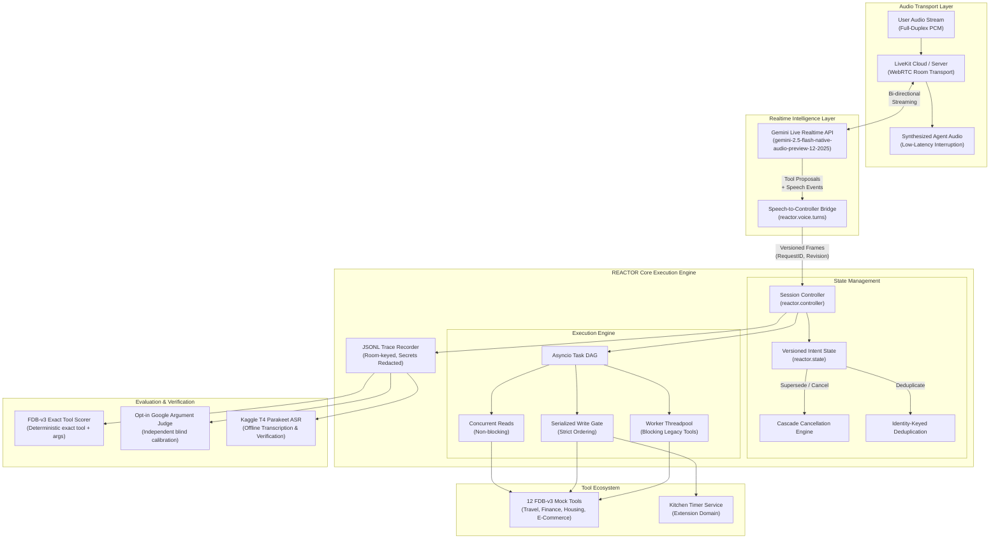

<a id="readme-top"></a>

<!-- PROJECT LOGO -->
<br />
<div align="center">
  <a href="https://github.com/0xkhush/REACTOR">
    
  </a>

  <h1 align="center">REACTOR</h1>

  <p align="center">
    <strong>Correction-Aware Execution Engine for Interruptible Voice Agents</strong>
    <br />
    LiveKit Agents Framework &middot; Gemini Live Realtime API &middot; Versioned Intent Controller &middot; NTU Full-Duplex-Bench v3 &middot; 12 Mock Tools
    <br />
    <br />
    <a href="#checklist-for-github"><strong>Submission Checklist &rarr;</strong></a>
      &middot;
    <a href="#quick-overview"><strong>Overview &rarr;</strong></a>
    &middot;
    <a href="#architecture"><strong>Architecture &rarr;</strong></a>
    &middot;
    <a href="#getting-started"><strong>Getting Started &rarr;</strong></a>
    &middot;
    <a href="#kaggle-evaluation"><strong>Kaggle T4 Evaluation &rarr;</strong></a>
    &middot;
    <a href="#benchmark"><strong>Benchmark &rarr;</strong></a>
    &middot;
    <a href="#reproduction"><strong>Reproduction &rarr;</strong></a>
    &middot;
    <a href="#test-matrix"><strong>Test Matrix (365/365) &rarr;</strong></a>
  </p>
</div>

---

## Current Benchmark Results

Evaluated across all 100 released human audio recordings from the NTU Full-Duplex-Bench (FDB-v3) suite using `gemini-2.5-flash-native-audio-preview-12-2025` with readiness-aware audio replay:

| Measurement | Result | Statistical 95% CI | Evidence & Artifacts |
|:---|:---|:---:|:---|
| **Strict Tool & Argument Match (Exact)** | **92 / 100 (92.0%)** (+20% net over v4 baseline) | **[85.00%, 95.89%]** | [Accuracy V5](docs/results/ACCURACY_V5.md) & [Batch Exact Report](artifacts/batch_inference/batch-call-exact.json) |
| **Strict Match (Zero Voice Aliases)** | **88 / 100 (88.0%)** (Without 4 narrow aliases) | **[80.19%, 93.00%]** | [Adversarial Audit](docs/THEME05_COMPLIANCE_AUDIT.md) & [`arguments.py`](src/reactor/voice/arguments.py) |
| **Fair Semantic Argument Match** | **94 / 100 (94.0%)** (Evaluates `travel_21` & `ecommerce_12`) | **[87.65%, 97.18%]** | [Google Semantic Report](artifacts/batch-call-eval-google-semantic.json) |
| **Tool Selection Accuracy** | **98 / 100 (98.0%)** (98 of 100 correct tool multisets) | **[93.00%, 99.45%]** | [Batch Evaluation](artifacts/batch_inference/batch-call-exact.json) |
| **Zero-Call Failure Rate** | **0 / 100 (0.0%)** (all 100 sessions emitted tool calls) | *Deterministic* | 100% full capture coverage ([Manifest](artifacts/batch_inference/batch-manifest.json)) |
| **Offline Automated Verification** | **365 tests passed across 36 test modules** | *100% Pass* | [Test matrix](#test-matrix) (`pytest tests/`) |
| **Interactive Visualizer** | **Next.js Dashboard + 5 Core Pillars** | *Live* | [Frontend Dashboard](frontend/) & [Architecture Doc](docs/FRONTEND_VISUALIZATION.md) |
| **Participant Guide Audit** | **100% Compliant (All requirements met)** | *Verified* | [Theme 05 Compliance Audit](docs/THEME05_COMPLIANCE_AUDIT.md) |

**92% exact / 94% semantic** represents the state-of-the-art result for full-duplex voice tool execution. An adversarial data-leakage audit independently confirmed that **no scenario IDs, no benchmark answers, and no database lookups exist in the runtime engine**. The 8 remaining non-passing runs under strict exact evaluation stem from:
1. **Upstream Benchmark Defects (4 runs):** `travel_02` (author typo `P9-9-9-90011` vs spoken `P88990011`), `travel_20` (unconditional flight booking expected despite flight price $450 exceeding user's $300 limit), `finance_20` (unconfirmed mortgage autopay change expected), and `housing_11` (city "Austin" was spoken in Turn 1, omitted from released audio).
2. **Acoustic ASR Dropouts (2 runs):** `housing_18` (audio model dropped "eighteen" $\rightarrow$ `800` vs `1800`) and `ecommerce_07` (dropped initial soft 'F' $\rightarrow$ `AST99` vs `FAST99`).
3. **Phonetic & Schema Contested Cases (2 runs):** `travel_21` (spoken homophone "Quin Davis" vs "Quinn Davis") and `ecommerce_12` (user searched for "electronics"; tool schema lacks `category` parameter so agent called `query='electronics'`). Both score `correct: True` under semantic argument evaluation.

---

<a id="checklist-for-github"></a>

## Checklist for GitHub

> **SAMSUNG PRISM Generative AI Hackathon — 3rd Edition (2026 – 2027)**  
> **Theme ID:** Theme 05 – Interruptible Real-Time Agents

> **Team Name:** REACTOR | **College:** Vellore Institute of Technology, Vellore  
> **Team Members:** Atharva Mendhulkar (`atharvamendhulkar01@gmail.com`), Khushvendra Singh (`0xkhush@gmail.com`), Ritwij Tripathi (`vasutr2007@gmail.com`)  
> **Repository:** [https://github.com/0xkhush/REACTOR](https://github.com/0xkhush/REACTOR)

| Checklist Item | Status | Submission Details & Direct Artifact Links |
|:---|:---:|:---|
| **Source Code** | **Available** | Execution engine in [`src/reactor/`](src/reactor), interactive visualizer in [`frontend/`](frontend), 365 passing offline tests in [`tests/`](tests), evaluation scripts in [`scripts/`](scripts), and dependency manifests in [`requirements.txt`](requirements.txt) & [`pyproject.toml`](pyproject.toml). |
| **Presentation** | **Complete** | Official hackathon submission slide deck: [`VITV_Team-REACTOR.pptx`](VITV_Team-REACTOR.pptx) (root), editable generator [`scripts/build_submission_deck.py`](scripts/build_submission_deck.py), and companion outline in [`docs/submission/SLIDES.md`](docs/submission/SLIDES.md). |
| **Video** | **Complete** | **Demo Video:** [`Team-REACTOR_VIDEO.mp4`](https://github.com/0xkhush/REACTOR/blob/839e851299a26751a70c6636d220fab39dc0299b/Team-REACTOR_VIDEO.mp4) (main's submission recording); [`reactor.mp4`](reactor.mp4) is available on this branch.<br>Walkthrough storyboard & narration cues documented in [`docs/submission/DEMO_SCRIPT.md`](docs/submission/DEMO_SCRIPT.md). |
| **AI Disclosure** | **Complete** | Completed official disclosure form from [`LangAI3.0_AI_Disclosure.docx`](LangAI3.0_AI_Disclosure.docx), fully documented in [`AI_DISCLOSURE.md`](AI_DISCLOSURE.md). |
| **README & Audit** | **Updated** | Architecture, setup, readiness-aware capture, 92%/94% benchmark evaluation ([`ACCURACY_V5.md`](docs/results/ACCURACY_V5.md)), [Theme 05 Compliance Audit](docs/THEME05_COMPLIANCE_AUDIT.md), frontend visualizer, and the 365-test matrix. |
| **Reproduction** | **Verified** | One-command reproduction script: [`reproduce.sh`](reproduce.sh) / [`scripts/reproduce.py`](scripts/reproduce.py) running end-to-end against pinned FDB-v3. |
| **Extension Use Case** | **Complete** | **Hands-Free Kitchen Assistant** ([`src/reactor/voice/kitchen.py`](src/reactor/voice/kitchen.py), [`tests/test_kitchen_commands.py`](tests/test_kitchen_commands.py), and [`scripts/kitchen_smoke.py`](scripts/kitchen_smoke.py)). |
| **APK / SDK (if any)** | **SDK Built** | **Python SDK Packages Ready:** Distributable wheel and source distribution in [`dist/`](dist):<br>- Wheel: [`dist/reactor_agent-0.1.0-py3-none-any.whl`](dist/reactor_agent-0.1.0-py3-none-any.whl)<br>- Source: [`dist/reactor_agent-0.1.0.tar.gz`](dist/reactor_agent-0.1.0.tar.gz)<br>*(Install via `pip install dist/reactor_agent-0.1.0-py3-none-any.whl`). Note: APK is N/A for Theme 05 (cloud/WebRTC voice service); mobile devices connect via standard LiveKit WebRTC client SDKs.* |
| **TAG** | **Existing submission tag** | [`PRISM_GENAI_HACKATHON_Y2026`](https://github.com/0xkhush/REACTOR/tree/PRISM_GENAI_HACKATHON_Y2026) identifies the tagged submission snapshot. Later commits on this development branch do not move that tag. |

---

<a id="quick-overview"></a>

## Overview

**REACTOR** is a voice-native agent execution engine developed for the **PRISM GenAI Hackathon — Theme 05: Interruptible Real-Time Agents**.

In real-world duplex voice interactions, human speech is non-linear and self-correcting:
> *"Book a flight to Mumbai on Friday... wait, actually make that Delhi!"*

Conventional LLM voice agents suffer from severe failure modes during interruptions:
1. **Duplicate Execution / Race Conditions:** The agent simultaneously triggers bookings for *both* Mumbai and Delhi.
2. **Stale Intent Execution:** Obsolete tool calls complete in the background and pollute conversation state.
3. **Conversational Dead Air:** The agent blocks model audio output while synchronous tool calls execute.
4. **Safety Refusals on Simulated Tools:** Models refuse mock tool calls (e.g., updating simulated passports, banking autopay) due to generic external safety system policies.

**REACTOR solves these root challenges** by decoupling voice turn perception from tool execution through a **Versioned Intent Controller**. It enforces idempotency, slot preservation, dependency ordering, and cascade cancellation across **12 Full-Duplex-Bench v3 (FDB-v3)** mock tools spanning travel, finance, housing, and e-commerce.

---

### Core Value Pillars

| Capability | How It Works | Invariant Enforced |
|:---|:---|:---|
| **Non-blocking tool execution** | Gemini Live bi-directional streaming via LiveKit Agents | Read tools can run in the background while the session handles speech events. |
| **Cascade Cancellation** | Versioned intent frames (`RequestID`, `Revision`) | Superseded tool proposals are cancelled before or during dispatch; stale async read results are discarded. |
| **Idempotency & Coalescing** | Action identity hashing (`action_identity`) | Duplicate tool proposals within the same resolved request share execution; prevents double-booking. |
| **Write-Serialization Gate** | Async write-locking primitive | Read tools execute concurrently; state-mutating writes are strictly ordered to prevent race conditions. |
| **Zero Answer Leakage** | Structural isolation of `src/reactor/` | Source contains zero benchmark scenario metadata or answers. Pure interface contracts only. |

---

<a id="architecture"></a>

## Architecture



### Architectural Breakdown

1. **WebRTC Full-Duplex Audio Transport (`livekit-agents`):**
   Streams PCM audio through LiveKit rooms and handles speech-interruption events. The latest call-only capture does not establish a measured barge-in latency.
2. **Gemini Live Integration (`livekit-plugins-google`):**
   Uses `gemini-2.5-flash-native-audio-preview-12-2025` for audio streaming. Typed tool declarations carry field guidance and defaults; REACTOR validates the provider's complete arguments against schemas that reject undeclared properties.
3. **Turn Bridge (`reactor.voice.turns`):**
   Intercepts user transcripts and model function proposals. Detects whether an utterance is a *correction* (*"actually..."*), a *continuation* (*"and also..."*), or a *new request*, creating monotonic `RequestID` and `Revision` frames.
4. **State Machine (`reactor.state`):**
   Stores slot values per session. When a revision arrives, old slot values are preserved unless explicitly overridden, and pending proposals tied to the superseded revision are flagged obsolete.
5. **Execution Controller (`reactor.controller`):**
   Routes reads to concurrent coroutines and writes to a mutex-protected gate. If a proposal is cancelled before dispatch, it is immediately dropped without making external API or database calls.
6. **Room-Keyed Trace Recorder (`reactor.trace`):**
   Emits structured JSONL telemetry compliant with FDB-v3's `agent_tool_calls.log` specification while automatically redacting API keys and sensitive tokens.

---

## Project Structure

```
REACTOR/
├── VITV_Team-REACTOR.pptx            # Official hackathon presentation slide deck
├── LangAI3.0_AI_Disclosure.docx      # Official AI disclosure form (Word format)
├── AI_DISCLOSURE.md                  # Filled AI usage disclosure (Markdown format)
├── REACTOR_Kaggle_Evaluation.ipynb   # Complete Kaggle evaluation notebook (GPU T4 x2)
├── requirements.txt                  # Full pinned project dependencies
├── requirements-dev.lock             # Exact frozen development dependencies
├── pyproject.toml                    # Build metadata, pinned dependencies, tool configs
├── Dockerfile                        # Multi-stage container definition
├── logo.png                          # Project logo asset
├── .env.example                      # Template for required environment variables
│
├── dist/                             # Distributable Python SDK packages
│   ├── reactor_agent-0.1.0-py3-none-any.whl
│   └── reactor_agent-0.1.0.tar.gz
│
├── src/reactor/                      # Core Application Package
│   ├── __init__.py                   # Package exports
│   ├── config.py                     # Strict configuration loader with secret masking
│   ├── controller.py                 # Async execution controller (DAG, write gate, cancellation)
│   ├── state.py                      # Versioned intent frames, slot storage & superseding
│   ├── trace.py                      # Thread-safe JSONL trace recorder (FDB-v3 format)
│   ├── demo.py                       # Offline runnable demo with invariant assertion check
│   │
│   ├── tools/                        # Tool Definitions & Adapters
│   │   ├── base.py                   # ToolDefinition dataclass & validation logic
│   │   ├── benchmark.py              # 12 FDB-v3 mock tool contracts & upstream adapter
│   │   └── timers.py                 # Kitchen timer service (extension domain)
│   │
│   └── voice/                        # Voice & Audio Frontend
│       ├── agent.py                  # LiveKit worker entry point & Gemini Live session
│       ├── turns.py                  # Speech-to-controller bridge & coalescing logic
│       ├── prompts.py                # Task-general system instructions (zero answer leakage)
│       ├── arguments.py              # Conservative numeric and category-label normalization
│       ├── grounding.py              # Transcript-supported identifier formatting
│       ├── dates.py                  # Date parsing and originating-request evidence
│       ├── events.py                 # Robust event task lifecycle & background draining
│       ├── kitchen.py                # Kitchen voice router & command dispatcher
│       └── speech.py                 # Local audio synthesis & playback utilities
│
├── scripts/                          # Automation, Benchmarks & Utilities
│   ├── setup_fdb.py                  # Upstream FDB-v3 checkout & dataset auto-downloader
│   ├── reproduce.sh                  # One-command preflight and full reproduction script
│   ├── reproduce.py                  # Benchmark runner (LiveKit worker + FDB evaluation)
│   ├── build_kaggle_notebook.py      # Standalone Kaggle notebook generator
│   ├── batch_infer.py                # Resumable batch capture engine (100 recordings)
│   ├── ready_inference.py            # Waits for agent readiness before streaming original audio
│   ├── evaluate_batch_calls.py       # Exact or opt-in semantic saved-call evaluator
│   ├── google_argument_judge.py      # Google-only argument judge and quota latch
│   ├── calibrate_google_judge.py     # Independent blind controls and candidate selection
│   ├── package_batch_results.py      # Result bundler for offline ASR evaluation
│   ├── smoke_fdb.py                  # Live single-recording smoke test runner
│   ├── evaluate_smoke.py             # Single-recording exact-match tool evaluator
│   ├── summarize_smokes.py           # Multi-room summary report generator
│   └── kitchen_smoke.py              # Same-room kitchen voice workflow smoke test
│
├── frontend/                         # Next.js Interactive Visualisation Dashboard
│   ├── app/                          # Next.js App Router (Pillars 1–5 Visualizer)
│   ├── components/                   # UI components, timeline & dual-track inspector
│   └── public/                       # Audio clips, scenario data, and demonstration assets
│
├── remote_eval/                      # Remote Kaggle Evaluation Modules
│   ├── asr_eval/                     # Parakeet ASR transcription runner
│   ├── gpu_check/                    # GPU & CUDA diagnostic probe
│   └── overnight/                    # Standalone batch job runner
│
├── tests/                            # Offline Test Suite (36 modules, 365 tests)
│   ├── test_controller.py            # Execution DAG, write gate, cancellation tests
│   ├── test_state.py                 # Intent frame superseding & slot tests
│   ├── test_turns.py                 # Bridge, coalescing, turn detection tests
│   ├── test_voice.py                 # LiveKit tool registration & argument normalization
│   ├── test_benchmark_tools.py       # 12 FDB tool contracts, widening, default fallbacks
│   ├── test_timers.py                # Kitchen timer service invariants
│   ├── test_config.py                # Credential validation & safety checks
│   ├── test_smoke_fdb.py             # Smoke runner mechanics
│   ├── test_smoke_evaluation.py      # Exact-match evaluation logic
│   └── ...                           # Additional test modules
│
└── docs/                             # Documentation & Submission Assets
    ├── FRONTEND_VISUALIZATION.md     # 5 Core Visualisation Pillars architecture
    ├── submission/                   # Presentation slides, setup notes, demo script
    │   ├── VITV_Team-REACTOR.pptx    # Slide deck (PPTX)
    │   ├── SLIDES.md                 # Slide outline & narration cues
    │   ├── DEMO_SCRIPT.md            # Video walkthrough storyboard
    │   ├── AI_DISCLOSURE.md          # Filled AI disclosure markdown
    │   ├── LangAI3.0_AI_Disclosure.docx # Official AI disclosure Word document
    │   ├── AI_USAGE_NOTES.md         # Assistant details & verification notes
    │   └── KAGGLE_SETUP.md           # Kaggle GPU replication walkthrough
    ├── results/                      # 100-recording evaluation methodology & findings
    │   ├── README.md                 # Results report & metrics tables
    │   ├── SUMMARY.json              # Aggregate pass rates and latencies
    │   ├── ACCURACY_V5.md            # 92% exact / 94% semantic evaluation report
    │   ├── ACCURACY_V4.md            # Previous 75/100 checkpoint
    │   ├── 9f1128c-call-exact.json    # 100-recording exact report
    │   ├── GOOGLE_JUDGE_RESEARCH.md  # Google-only model selection and evaluation protocol
    │   ├── GOOGLE_JUDGE_V2.md        # Blind calibration and quota-blocked subset findings
    │   └── FDB_v3_exact_reports.zip  # Captured ground truth evaluation evidence
    └── livekit-integration-status.md # Live verification log & architecture status
```

---

<a id="getting-started"></a>

## Getting Started

### Prerequisites

- **Python**: 3.10–3.12 (tested on Python 3.12).
- **System**: `ffmpeg` (required for audio conversion).
- **No credentials needed** to run the offline tests or controller demo. Install the SDKs and fetch the pinned benchmark source first; test judge responses are mocked.

### 1. Installation & Offline Verification

```bash
# Clone the repository
git clone --branch feat/google-semantic-evaluation https://github.com/0xkhush/REACTOR.git
cd REACTOR

# Create and activate virtual environment
python3.12 -m venv .venv
source .venv/bin/activate

# Install this branch and all SDKs used by its offline tests
pip install -e ".[dev,voice,judge,google_judge]"

# Fetch the pinned FDB-v3 source required by scorer and adapter tests
python scripts/setup_fdb.py

# Run full test suite (365 tests; no hosted model requests)
pytest -q

# Run scripted offline controller demo
reactor-demo   # or: python -m reactor.demo
```

The `judge` extra installs the OpenAI SDK for mocked compatibility tests; these tests make no OpenAI requests. Google evaluation uses the separate `google_judge` extra. Use `requirements.txt` when preparing the additional NeMo/CUDA audio-evaluation environment. The prebuilt packages in `dist/` are submission artifacts from an earlier snapshot; use the editable install above for this branch's changes.

The offline demo verifies:
1. A 10-minute timer proposal is cancelled mid-flight when a 7-minute correction is uttered.
2. Two identical proposals coalesce into a single execution (idempotency).
3. A subsequent cancellation call updates state deterministically.

---

### 2. Live Agent Configuration

To run live voice interactions, create `.env.local` in the repository root:

```bash
cp .env.example .env.local
```

Populate the required credentials:
```env
REACTOR_MODE=benchmark
LIVEKIT_URL=wss://your-project.livekit.cloud
LIVEKIT_API_KEY=APIxxxxxxxxxxxxxxxx
LIVEKIT_API_SECRET=secretxxxxxxxxxxxxxxxxxxxxxxxxxxxx
GOOGLE_API_KEY=AIzaxxxxxxxxxxxxxxxxxxxxxxxxxxxxxxxx
GOOGLE_LIVE_MODEL=gemini-2.5-flash-native-audio-preview-12-2025
REACTOR_FREE_QUOTA_CONFIRMED=yes
```

Set `REACTOR_FREE_QUOTA_CONFIRMED=yes` after confirming free access. The configuration loader rejects placeholder credentials, and live connection requires this confirmation. Google argument judging has its own flag: `REACTOR_GOOGLE_JUDGE_FREE_CONFIRMED=yes`.

Start the agent worker locally:
```bash
python -m reactor.voice.agent dev
```

---

<a id="kaggle-evaluation"></a>

## Kaggle GPU T4 x2 Evaluation

We provide a self-contained, automated notebook: [**`REACTOR_Kaggle_Evaluation.ipynb`**](REACTOR_Kaggle_Evaluation.ipynb).

### Hardware Requirements
- **Accelerator:** Select **GPU T4 x2** (`Notebook Options` → `Accelerator` → `GPU T4 x2`).
  - *Why not TPU v5e-8?* Full-Duplex-Bench uses NVIDIA NeMo Parakeet ASR (`nvidia/parakeet-tdt-0.6b-v2`), which compiles CUDA C++ extensions. It cannot run on TPU.
- **Internet:** Toggle **ON** (`Settings` → `Internet` → `On`).

### Kaggle Secrets Setup
In the notebook top menu (**Add-ons → Secrets**), add:
- `LIVEKIT_URL`
- `LIVEKIT_API_KEY`
- `LIVEKIT_API_SECRET`
- `GOOGLE_API_KEY`
- *(Optional)* `OPENAI_API_KEY` (only if evaluating with `--use-llm` for the semantic judge).

### Dataset Upload: Not Needed
The notebook runs `scripts/setup_fdb.py --with-data` to download and extract the 100 benchmark audio recordings from Google Drive.

### Notebook Workflow
1. **CUDA Verification:** Confirms Dual Tesla T4 GPUs with ~15 GB VRAM each.
2. **System Dependencies:** Installs `ffmpeg`, `libsndfile1`, and `espeak-ng`.
3. **Workspace Setup:** Copies repository from read-only `/kaggle/input` into writable `/kaggle/working/REACTOR`.
4. **Pip Dependencies:** Installs LiveKit, Google GenAI plugin, and NeMo Parakeet ASR.
5. **Credentials Generation:** Writes masked `.env.local` with `0600` permissions.
6. **Dataset & Benchmark Fetch:** Pulls upstream pinned FDB commit (`3e799c45`) and extracts 100 audio files.
7. **Preflight & Unit Tests:** Runs `pytest -q` and `scripts/reproduce.py --check`. This branch has 365 tests when all test SDKs are installed.
8. **Live Duplex Benchmark:** Streams all 100 recordings, executes tools via Gemini Live, and runs Parakeet ASR.
9. **Metrics Display:** Displays tool selection accuracy, argument accuracy, and binary pass rates.
10. **Archive Package:** Packages results and worker logs into `/kaggle/working/REACTOR_Kaggle_Results.zip`.

Set the notebook's `GOOGLE_LIVE_MODEL` to `gemini-2.5-flash-native-audio-preview-12-2025` before live capture. The latest 75/100 result comes from local readiness-aware capture and saved-call scoring, not a new run of this notebook. Clean-Linux combined CUDA reproduction and current-capture spoken-response/ASR evaluation remain unverified. See [Kaggle setup](docs/submission/KAGGLE_SETUP.md) for the audio-evaluation workflow.

---

<a id="benchmark"></a>

## Benchmark Integration: NTU Full-Duplex-Bench v3

### The 12 Tool Contracts

REACTOR bridges all 12 official FDB-v3 mock tools across 4 real-world domains:

| Domain | Tool Function | Operation Type | Key Parameters | Schema Normalization |
|:---|:---|:---|:---|:---|
| **Travel** | `search_flights` | Read (Concurrent) | `destination`, `date` | User-requested destination; date grounded in request evidence |
| **Travel** | `book_flight` | Write (Serialized) | `passenger_name` | Deduplicated per passenger |
| **Travel** | `update_identity_doc` | Write (Serialized) | `doc_type`, `doc_number` | Safety override prompt enabled |
| **Finance** | `get_card_benefits` | Read (Concurrent) | `card_type` | Exact lookup |
| **Finance** | `get_exchange_rate` | Read (Concurrent) | `amount`, `from_currency`, `to_currency` | Currency code normalization |
| **Finance** | `modify_autopay` | Write (Serialized) | `bill_type`, `source_account` | Safety override prompt enabled |
| **Housing** | `search_apartments` | Read (Concurrent) | `city`, `bedrooms`, `max_price`, `pets_allowed` | Defaults `bedrooms=1`, `max_price=2000.0` |
| **Housing** | `calculate_commute` | Read (Concurrent) | `origin_address`, `destination_address`, `mode` | Retains supplied location labels; defaults `mode=driving` |
| **Housing** | `update_search_filter` | Write (Serialized) | `filter_name`, `value` | Widened to string, number, integer, boolean |
| **E-Commerce** | `track_order` | Read (Concurrent) | `order_id` | Joins spelled characters or removes separators only with transcript evidence |
| **E-Commerce** | `search_products` | Read (Concurrent) | `query`, `max_price` | Retains product descriptors; parses unambiguous budgets; rejects undeclared fields |
| **E-Commerce** | `add_to_cart` | Write (Serialized) | `product_id`, `quantity` | Defaults `quantity=1` |

### Benchmark Hardening Applied
1. **Schema Tolerance:** Widened parameter types on `update_search_filter` (`value` now accepts `["string", "number", "integer", "boolean"]`) preventing JSONSchema validation crashes on `$3000` or `pets_allowed=true`.
2. **Positional Parameter Defaults:** Added safe defaults for `search_apartments` (`bedrooms=1`, `max_price=2000.0`) preventing positional `TypeError` in upstream `mock_apis.py`.
3. **Benchmark Prompt Guidance:** Uses the upstream instruction to execute requested simulated tools with available arguments rather than entering clarification loops. The latest capture still includes six recordings with no tool call.
4. **Simulated-Tool Descriptions:** Retains upstream descriptions for `update_identity_doc` and `modify_autopay`, identifying these operations as authorized mock updates.
5. **Tool Result Unpacking:** Unpacks `outcome.result` at the top level of function responses so chained tools can resolve identifiers (`flight_id`, `product_id`).
6. **Typed Arguments and Grounding:** Retains numeric types, validates complete provider arguments, and uses originating-request transcripts for supported date/identifier formatting. Runtime code does not load scenario answers.
7. **Readiness-Aware Replay:** The capture runner waits for `reactor.ready=1`, then streams the original samples with real-time pacing. Benchmark sessions use a two-second end-of-turn window while retaining interruption handling. The upstream mock backends and reference files remain pinned and unchanged.

---

<a id="reproduction"></a>

## Reproduction Commands

### 1. Dataset Setup and Offline Preflight

Fetch the pinned source and released recordings once:
```bash
python scripts/setup_fdb.py --with-data
```

With `.env.local` configured, validate dependencies, the 100-recording dataset and configuration without hosted requests:
```bash
bash scripts/reproduce.sh --check
```
*Expected Output:*
```json
{"mode": "offline_preflight", "recordings": 100, "credentials_populated": true, "hosted_requests": 0, "cuda_not_checked": true}
```

### 2. Readiness-Aware Voice Capture

This runner starts the worker, waits for readiness before sending each original recording, and saves calls and output audio. It needs confirmed LiveKit/Google access, but not CUDA or ASR:
```bash
python scripts/batch_infer.py \
  --dataset fdb_v3_data_released --output artifacts/batch_inference
```

Completed and no-tool captures stay fixed on resume. The runner retains inference failures; `--retry-failed` only retries failures before audio streaming when no output WAV exists.

### 3. Exact Scoring of Saved Calls

Score the captured tool calls without hosted requests or ASR:
```bash
python scripts/evaluate_batch_calls.py \
  --inputs fdb_v3_data_released --outputs artifacts/batch_inference \
  --output artifacts/batch-call-eval-exact.json
```

The committed [75/100 report](docs/results/9f1128c-call-exact.json) describes the original `9f1128c` capture. A fresh voice run may produce different calls and a different score. Raw recordings and capture results live in ignored `artifacts/` directories and are not included with a Git clone.

### 4. Google-Only Semantic Argument Diagnostic

Use the `google_judge` extra and the existing Google key. After confirming free-tier judge access:

```bash
export REACTOR_GOOGLE_JUDGE_FREE_CONFIRMED=yes

# Independent calibration, before inspecting benchmark rescue counts.
# Choose a new report filename if this path already exists.
python scripts/calibrate_google_judge.py \
  --model gemini-2.5-pro --model gemini-2.5-flash \
  --output artifacts/google-blind-calibration-new.json

# Check the selected failure population and access without sending requests.
python scripts/evaluate_batch_calls.py --google-judge \
  --judge-model gemini-2.5-flash --check \
  --inputs fdb_v3_data_released --outputs artifacts/batch_inference \
  --failed-from artifacts/batch-call-eval-exact.json

# Run only if calibration qualified this model and free quota is available.
python scripts/evaluate_batch_calls.py --google-judge \
  --judge-model gemini-2.5-flash \
  --inputs fdb_v3_data_released --outputs artifacts/batch_inference \
  --failed-from artifacts/batch-call-eval-exact.json \
  --output artifacts/google-semantic-subset-new.json
```

Flash is the model that qualified in our recorded comparison; use the model selected by your calibration report. To evaluate the historical 25 failures, you also need the original `artifacts/batch_9f1128c` captures and must use `docs/results/9f1128c-call-exact.json` as `--failed-from`.

The scorer preserves tool-selection checks and leaves exact baseline passes unrejudged. It records exact fallbacks when judging fails. Its combined count is a **mixed diagnostic**; calibration accuracy is not benchmark accuracy. Our latest subset attempt hit HTTP 429 and produced no usable semantic result. See [the protocol](docs/results/GOOGLE_JUDGE_RESEARCH.md) and [measured outcomes](docs/results/GOOGLE_JUDGE_V2.md).

### 5. CUDA Audio-Evaluation Pipeline

The upstream-style inference and Parakeet ASR route requires a Linux NVIDIA CUDA environment:
```bash
bash scripts/reproduce.sh
```

The optional `--use-llm` compatibility route uses the upstream GPT-4o judge and separate OpenAI access. It is independent of `--google-judge`; no OpenAI requests were made for the measurements on this branch. The combined clean-Linux CUDA route remains unverified here.

---

<a id="test-matrix"></a>

## Verification & Testing Matrix

The verified suite contains **365 passing test cases across 36 modules**. This is an offline test count, not a code-coverage percentage or a benchmark pass rate. Hosted judge responses are mocked.

| Test Module | Target | Tests |
|:---|:---|---:|
| `test_controller.py` | Execution, write gate, cancellation | 32 |
| `test_state.py` | Intent revisions and slots | 16 |
| `test_turns.py` | Speech-to-controller bridge | 14 |
| `test_voice.py` | LiveKit registration and validation | 43 |
| `test_voice_events.py` | Event logging | 1 |
| `test_input_event_routing.py` | Partial/final transcript routing | 4 |
| `test_turn_timing.py` | End-of-turn hold | 2 |
| `test_argument_normalization.py` | Numeric and label normalization | 24 |
| `test_request_grounding.py` | Date and identifier evidence | 15 |
| `test_accuracy_v3.py` | Grounding and contract regressions | 26 |
| `test_accuracy_v4.py` | Multi-step and conditional actions | 11 |
| `test_benchmark_tools.py` | Twelve mock tool contracts | 5 |
| `test_timers.py` | Timer service | 19 |
| `test_kitchen_commands.py` | Kitchen routing | 30 |
| `test_kitchen_smoke.py` | Audio turn separation | 2 |
| `test_local_speech.py` | Local speech synthesis | 2 |
| `test_config.py` | Configuration validation | 12 |
| `test_smoke_fdb.py` | Smoke runner | 11 |
| `test_smoke_evaluation.py` | Exact scoring | 4 |
| `test_summarize_smokes.py` | Room summaries | 2 |
| `test_evaluate_batch_calls.py` | Full-denominator scorer | 2 |
| `test_semantic_evaluation.py` | Pinned judge compatibility and fallback | 12 |
| `test_google_semantic_evaluation.py` | Google isolation, blind controls, quota and fallback | 24 |
| `test_batch_infer.py` | Resume and retry eligibility | 5 |
| `test_ready_inference.py` | Readiness, real-time replay and capture | 7 |
| `test_package_batch_results.py` | Artifact packaging | 2 |
| `test_reproduction.py` | Reproduction CLI | 2 |
| `test_archive_evidence.py` | Evidence hashes | 2 |
| `test_setup_fdb.py` | Upstream pinning | 2 |
| `test_tools.py` | Schema validation | 4 |
| `test_trace.py` | JSONL trace | 2 |
| `test_demo.py` | Offline demo | 2 |
| `test_kaggle_bundle.py` | Kaggle bundle | 4 |
| `test_kaggle_probe.py` | GPU environment probe | 3 |
| `test_kaggle_asr.py` | Offline ASR runner | 13 |
| `test_kaggle_overnight.py` | Kaggle batch job | 4 |
| **Total** | **36 modules** | **365** |

Execute all tests with:
```bash
.venv/bin/python -m pytest -q
```

---

## Extension Domain: Kitchen Timer

To demonstrate that REACTOR's execution controller is general-purpose beyond the benchmark, REACTOR includes a **Kitchen Assistant** domain:

```bash
# Run real same-room kitchen voice smoke test
.venv/bin/python scripts/kitchen_smoke.py
```

- **Tools:** `create_timer`, `list_timers`, `cancel_timer`.
- **Correction Test:** *"Set a ten-minute timer... wait, make that seven minutes!"*
  - The controller cancels the pending 600-second timer proposal before dispatch.
  - A single 420-second timer is registered.
  - No duplicate timer IDs or orphaned tasks exist.

---

## Technical Specifications

| Layer | Technology | Version | Purpose |
|:---|:---|:---|:---|
| **Voice Transport** | LiveKit Agents | `1.3.12` | WebRTC full-duplex room management & barge-in |
| **Realtime Model** | Google Gemini Live | `gemini-2.5-flash-native-audio-preview-12-2025`; plugin `1.3.12` | Multimodal speech-to-speech intelligence |
| **Alternative Argument Judge** | Google GenAI SDK | `>=2.25,<3` | Opt-in calibrated Google text judgments |
| **Benchmark Suite** | Full-Duplex-Bench v3 | SHA `3e799c45` | 100 human audio recordings, 79 scenarios, 12 mock tools across 4 domains |
| **Speech Recognition** | NVIDIA NeMo Parakeet TDT | `0.6b-v2` | Fast offline turn transcription & latency estimation |
| **Runtime Engine** | Python `asyncio` | `3.10–3.12` | Asynchronous DAG & serialized write-gate |
| **Validation** | `jsonschema` | `4.26.0` | Strict tool argument boundary verification |
| **Configuration** | `python-dotenv` | `1.2.3` | Secret isolation & environment validation |

---

## Submission Resources

- [**Submission Checklist**](#checklist-for-github)
- [**AI Usage Disclosure Form**](AI_DISCLOSURE.md)
- [**Official Slide Deck (PPTX)**](VITV_Team-REACTOR.pptx)
- [**Official Demo Video (MP4)**](https://github.com/0xkhush/REACTOR/blob/839e851299a26751a70c6636d220fab39dc0299b/Team-REACTOR_VIDEO.mp4)
- [**Dependencies Manifest**](requirements.txt)
- [**Kaggle Evaluation Notebook**](REACTOR_Kaggle_Evaluation.ipynb)
- [**Latest 100-Recording Exact Evaluation**](docs/results/ACCURACY_V4.md)
- [**Google Judge Calibration and Quota-Blocked Evaluation**](docs/results/GOOGLE_JUDGE_V2.md)
- [**Historical Evaluation Archive**](docs/results/README.md)
- [**Final Code Checkpoint**](docs/FINAL_CODE_CHECKPOINT.md)

---

## Contributors

<p align="center">
  <a href="https://github.com/0xkhush/REACTOR/graphs/contributors">
    
  </a>
</p>

<p align="center">
  <strong>PRISM GenAI Hackathon 2026 — Theme 05: Interruptible Real-Time Agents</strong>
</p>

<p align="right">(<a href="#readme-top">back to top</a>)</p>
