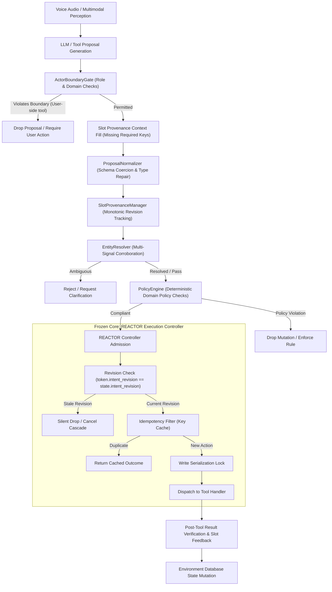

# REACTOR System Architecture: Code-Derived Reconstruction

## 1. Actual Implemented Execution Pipeline

The current REACTOR architecture does not follow an unverified conceptual flow; it is implemented directly across `src/reactor/controller.py`, `src/reactor/state.py`, and `src/reactor/guards/pipeline.py`.

---

## 2. Subsystem Specification

| Subsystem | Source Location | Frozen Core? | Inputs | Outputs | Primary State Maintained | Affects Pass@1? | Affects Safety? |
| :--- | :--- | :--- | :--- | :--- | :--- | :--- | :--- |
| **REACTOR Controller** | [`controller.py`](file:///Users/atharvamendhulkar/desktop/reactor/src/reactor/controller.py) | **YES** | `Proposal(token, action_id, tool, args)` | `Outcome(status, result, error)` | Active revision, write locks, completed action cache | Indirectly (executes admitted valid actions) | **Primary safety engine** (guarantees 0 stale, 0 duplicate) |
| **Session State** | [`state.py`](file:///Users/atharvamendhulkar/desktop/reactor/src/reactor/state.py) | **YES** | Input turn events, revision increments | `RequestToken`, state transitions | `request_id`, `intent_revision`, `active_actions`, `action_graph` | No | Guarantees monotonic revision invariants |
| **Actor Boundary Gate** | [`guards/boundary.py`](file:///Users/atharvamendhulkar/desktop/reactor/src/reactor/guards/boundary.py) | NO | Tool name, active domain, active role, user text | `ToolAdmissionResult(allowed, code, reason)` | Tool ownership registry, domain tool bindings | **Major impact** (-19 Pass@1 in offline Telecom; blocks user tools) | Prevents agent from spoofing user actions |
| **Proposal Normalizer** | [`guards/normalizer.py`](file:///Users/atharvamendhulkar/desktop/reactor/src/reactor/guards/normalizer.py) | NO | Raw model arguments dict, JSON schema | Normalized arguments dict, `AdmissionResult` | Stateless | Small positive impact (repairs malformed JSON/types) | Prevents schema runtime crashes |
| **Slot Provenance Manager** | [`guards/provenance.py`](file:///Users/atharvamendhulkar/desktop/reactor/src/reactor/guards/provenance.py) | NO | Slot key, value, revision, source | `SlotRecord(name, value, revision, status)` | Monotonic slot map `Dict[str, SlotRecord]` | Zero measurable lift in offline replay | Prevents slot contamination across interruptions |
| **Entity Resolver** | [`guards/entity.py`](file:///Users/atharvamendhulkar/desktop/reactor/src/reactor/guards/entity.py) | NO | Query dict, candidate pool, confidence cutoffs | `EntityResolutionResult(status, entity, conf)` | Calibrated cutoffs (`conf=0.88`, `margin=0.10`) | Zero measurable lift in offline replay | Prevents identity misattribution |
| **Policy Engine** | [`guards/policy.py`](file:///Users/atharvamendhulkar/desktop/reactor/src/reactor/guards/policy.py) | NO | Domain, tool name, arguments, environment tools | `PolicyEvaluationResult(status, code, reason)` | Authoritative environment queries | **Positive lift** (+3 tasks / +6.00 pp Airline lift) | Prevents invalid database mutations and rule violations |
| **Guarded Pipeline** | [`guards/pipeline.py`](file:///Users/atharvamendhulkar/desktop/reactor/src/reactor/guards/pipeline.py) | NO | Tool proposal + context | Sequential admission, controller outcome | Pipeline orchestrator | Orchestrates all upstream guards | End-to-end admission boundary |

---

## 3. Subsystem Detailed Analysis

### A. Execution Controller (`src/reactor/controller.py`)
* **Core Invariants**:
  1. **Monotonic Revision Gating**: Any proposal whose `request.intent_revision` does not match the active session revision is immediately aborted or suppressed. Stale operations are never dispatched to execution handlers.
  2. **Write Serialization**: State-modifying tools (`state_modifying=True`) acquire an exclusive lock per session. Concurrent state mutations are strictly serialized.
  3. **Idempotency Protection**: Action IDs are tracked in an execution registry. Re-entrant or duplicate proposal submissions return the cached outcome without re-executing the underlying tool handler.
  4. **Cancellation Cascade**: When a user interruption or correction is detected (`controller.resolve_input(mode="correction")`), pending and in-flight non-blocking tasks belonging to prior revisions are cancelled.

### B. Upstream Guardrails (`src/reactor/guards/`)
* Built completely outside `controller.py` and `state.py` to preserve the core execution guarantees while addressing model perception and policy failures.
* **Separation of Concerns**: The controller does not decide business logic or validate customer identities; it assumes admitted proposals are structurally intentional. The guardrails serve as the admission firewall between unconstrained LLM generations and the deterministic execution engine.
