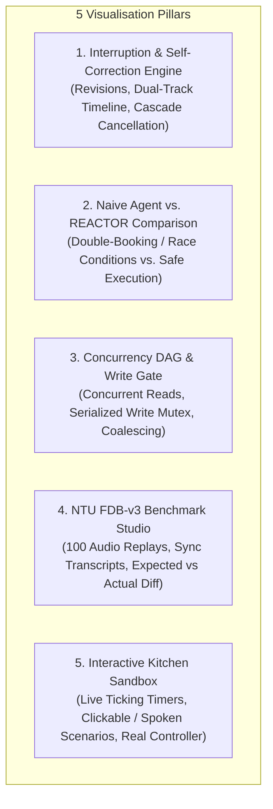
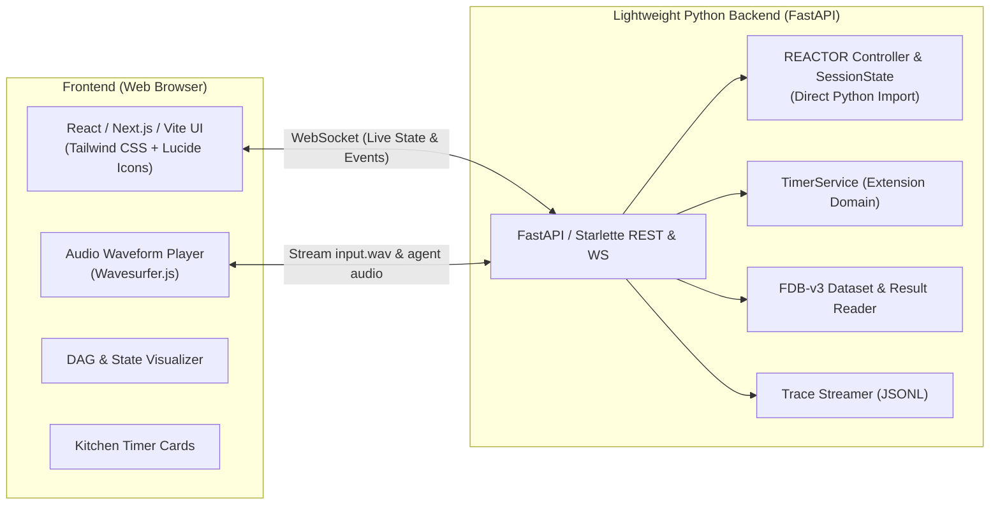

# REACTOR: Frontend Demonstration & Visualisation Architecture

## 1. Executive Summary

**REACTOR** (*Correction-Aware Execution Engine for Interruptible Voice Agents*) solves critical failure modes inherent to real-time, full-duplex voice interactions: race conditions, stale intent execution, dead air, and slot clobbering when users self-correct mid-utterance.

Currently, REACTOR's core mechanisms—versioned intent tokens, pre-dispatch cascade cancellation, action identity coalescing, non-blocking concurrent reads, and write serialization—execute headlessly in asynchronous Python runtimes and WebRTC audio streams.

A visual demonstration frontend bridges this gap by **making the invisible asynchronous engine visible**. Instead of merely listening to an agent reply over audio, an evaluator, hackathon judge, or developer can see:
- The exact millisecond where a superseded tool call is aborted before reaching backends.
- How preserved conversation slots survive across intent revisions.
- How concurrent reads execute concurrently while state-mutating writes queue behind a strict async write-gate.
- Real-world benchmark performance across 100 actual human audio recordings from the NTU Full-Duplex-Bench (FDB-v3) suite.

---

## 2. What We Can Show: The 5 Core Visualisation Pillars

---

### Pillar 1: The Interruption & Self-Correction Engine (The "Secret Sauce")

Demonstrates how REACTOR dynamically tracks human speech turns and reconciles intent revisions in real time.

* **Dual-Track Timeline**:
  * **Perception Track**: Visual stream of incoming audio / transcript chunks:
    > *"Book a flight to Mumbai on Friday... wait, actually make that Delhi!"*
  * **Intent Revision Track**: Real-time visualization of monotonic intent frames:
    $$\text{RequestID } 1, \text{ Revision } 1 \longrightarrow \text{RequestID } 1, \text{ Revision } 2$$
* **Slot Preservation Inspector**:
  * Live slot table displaying preserved context vs. updated parameters:
    * `passenger_name = "Alice"` (retained from Revision 1).
    * `departure_date = "Friday"` (retained from Revision 1).
    * `destination = "Delhi"` (updated in Revision 2 with a visual diff highlight).
* **Cascade Cancellation Display**:
  * Visual node badges for proposed operations:
    * `op-1` (`search_flights(Mumbai)`) $\rightarrow$ **`cancelled_before_dispatch`** (pulsing red strike-through, showing 0ms and \$0 wasted on external APIs).
    * `op-2` (`search_flights(Delhi)`) $\rightarrow$ **`launched`** $\rightarrow$ **`succeeded`** (green glow).

---

### Pillar 2: "Naive Voice Agent vs. REACTOR" (The Instant "Aha!" Moment)

A side-by-side comparative simulation showcasing why full-duplex voice breaks conventional architectures:

| Failure Mode | Standard LLM Voice Agent | REACTOR Voice Engine |
|:---|:---|:---|
| **Human Self-Correction** (*"Mumbai... wait, Delhi"*) | Fires both `book_flight(Mumbai)` and `book_flight(Delhi)`. Both book successfully in background. Double charge, double booking. | Flags Revision 1 superseded. Aborts `book_flight(Mumbai)` before dispatch. Only `book_flight(Delhi)` runs. |
| **Rapid Double Proposal** (Model stutter / retry) | Executes two separate instances of the same mutation, creating duplicate database records. | Hashes action fingerprint; coalesces duplicate into single execution (`duplicate_operation_id == op-1`). |
| **Conversational Dead Air** | Blocks model audio output while synchronous tool calls execute. | Non-blocking execution; background reads run concurrently without blocking speech. |
| **Slot Preservation** | Model often forgets previously stated slots when processing an interruption. | Deterministic `SessionState` preserves slots across revisions unless explicitly overridden. |

---

### Pillar 3: Concurrency DAG & Write-Serialization Gate

Visualizes the asynchronous execution engine (`reactor.controller`):

* **Interactive Concurrency Canvas**:
  * **Non-blocking Concurrent Read Lane**: Multiple read tools (e.g., `calculate_commute`, `search_apartments`, `get_card_benefits`) running in parallel.
  * **Serialized Write-Gate**: Mutex-protected lane ensuring state-mutating actions (e.g., `book_flight`, `modify_autopay`, `create_timer`) execute strictly one-at-a-time, eliminating race conditions.
* **Action Identity Coalescing Radar**:
  * Visualizes the hash fingerprinting `(request_id, intent_revision, tool, args_hash)`.
  * Demonstrates how redundant model function emissions merge cleanly into existing tasks.
* **Latency Waterfall & Execution Gantt Chart**:
  * Turn perception latency $\rightarrow$ Admission gate hold duration $\rightarrow$ Backend execution time $\rightarrow$ Result synthesis.

---

### Pillar 4: NTU Full-Duplex-Bench (FDB-v3) Benchmark Studio

The repository includes all **100 original human audio recordings** and evaluation reports across 4 domains:

| Domain | Available Mock Tools | Benchmark Scenarios |
|:---|:---|:---|
| **Travel** | `search_flights`, `book_flight`, `update_identity_doc` | Flight destination self-corrections, authorized mock passport updates |
| **Finance** | `get_card_benefits`, `get_exchange_rate`, `modify_autopay` | Currency conversion revisions, bill autopay edits |
| **Housing** | `search_apartments`, `calculate_commute`, `update_search_filter` | Apartment searches, commute calc, filter widening |
| **E-Commerce** | `track_order`, `search_products`, `add_to_cart` | Disfluencies ("A-B-C-1-2-3"), self-corrections (shoes $\rightarrow$ boots) |

**What the Benchmark Studio displays:**
1. **Scenario Explorer**: Filter by Domain, Difficulty (`easy`/`medium`/`hard`), State Rollback Test (`true`/`false`), and Result (`Pass` vs. `Fail`).
2. **Synchronized Audio & Transcript Player**:
   * Interactive audio waveform playing `input.wav` directly from `fdb_v3_data_released/`.
   * Real-time transcript caption bubbles highlighting speech hesitations, background noise, and self-correction tokens.
3. **Expected vs. Actual Tool Call Diff**:
   * Ground truth tool call vs. REACTOR captured tool call (from `docs/results/9f1128c-call-exact.json`).
   * Color-coded argument verification (green matching slots, red discrepancies).

---

### Pillar 5: Interactive Kitchen Assistant Sandbox (Live Hands-On Playground)

REACTOR includes an extension domain (`TimerService`) that runs in pure Python offline without requiring external API keys:

* **Live Animated Timers**:
  * Circular progress meters and countdown clocks for active timers (`pasta`, `tea`, `oven`).
  * Real-time state transitions: `running`, `paused`, `cancelled`, `completed`.
* **One-Click Pre-baked Demonstrations**:
  1. **The Classic Correction**: *"Set a 10-minute timer for pasta... wait, make that 7 minutes."*
     * Watch the 600s timer get cancelled before dispatch and the 420s timer register.
  2. **Duplicate Coalescing**: Fires two identical proposals simultaneously; UI shows they coalesce into one timer ID.
  3. **Explicit Cancellation**: *"Cancel the pasta timer"* $\rightarrow$ State transitions cleanly to cancelled.
* **Custom Utterance Input**:
  * Text box or microphone input allowing live test commands against the local controller.
* **Live JSON State & Telemetry Stream**:
  * Collapsible panel with the exact `controller.snapshot()` output and raw JSONL trace events (`proposed`, `launched`, `cancelled_before_dispatch`, `succeeded`).

---

## 3. Recommended Technical Architecture

A clean, responsive, and self-contained web architecture:

### Key Technical Advantages
1. **Zero Mocking of Engine Logic**: The backend directly imports `from reactor.controller import Controller` and `from reactor.tools.timers import TimerService`. The UI visualizes authentic, real Python engine execution.
2. **100% Offline Capable**: All 100 benchmark audio recordings, metadata, and evaluation results already live in the repository (`fdb_v3_data_released/`, `docs/results/`). The app runs instantly without internet access or API keys.
3. **Optional Live LiveKit Streaming**: If credentials in `.env.local` are configured, the web client can optionally attach to real-time WebRTC LiveKit rooms.

---

## 4. Proposed Screen & UI Layout

### Screen 1: "The Engine" (Interactive Explainer & Hero)
* **Top Banner**: Utterance Stepper (Step 1: Speech Begins $\rightarrow$ Step 2: Model Proposes $\rightarrow$ Step 3: Self-Correction Interruption $\rightarrow$ Step 4: Resolution).
* **Center**: Concurrency DAG with Write-Gate and Non-blocking Read Lane.
* **Bottom**: Live Slot State table and Cascade Cancellation timeline.

### Screen 2: "Kitchen Playground" (Live Interactive Sandbox)
* **Left**: Interactive Command Prompt with one-click demo scenario chips.
* **Center**: Real-time Kitchen Timer Cards with live progress rings.
* **Right**: Live execution log showing real-time controller events.

### Screen 3: "Benchmark Studio" (NTU Full-Duplex-Bench Replays)
* **Left Panel**: Filterable scenario list (100 scenarios with domain badges, difficulty, and pass/fail indicators).
* **Center Panel**: Waveform audio player with synchronized transcript bubbles and disfluency highlights.
* **Right Panel**: Ground Truth vs. Actual Tool Call JSON diff viewer.

### Screen 4: "Metrics & Architecture" (Evaluation Dashboard)
* **KPI Scorecards**: 75/100 Strict Exact Pass, 89/100 Tool Selection, 94/100 Completed Runs, 358 Passing Tests.
* **Architecture Diagram**: Interactive system overview with clickable components (WebRTC transport, Gemini Live, Turn Bridge, Execution Controller).
